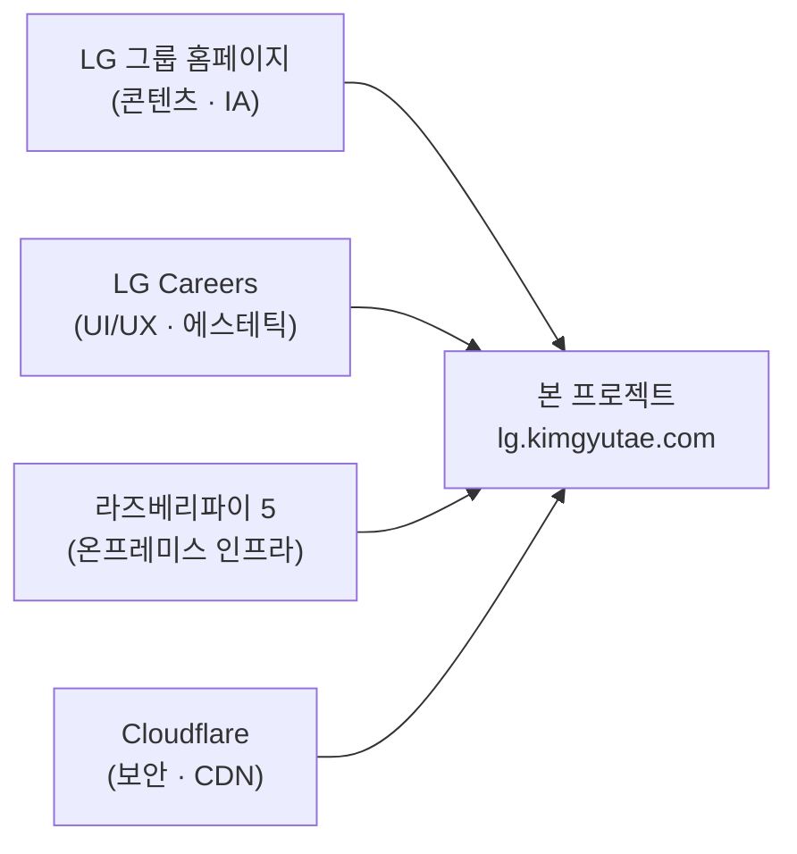
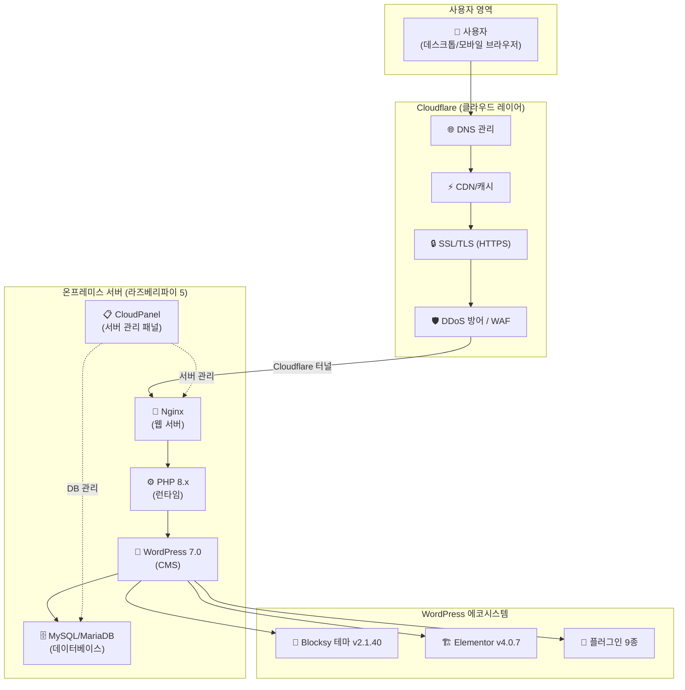
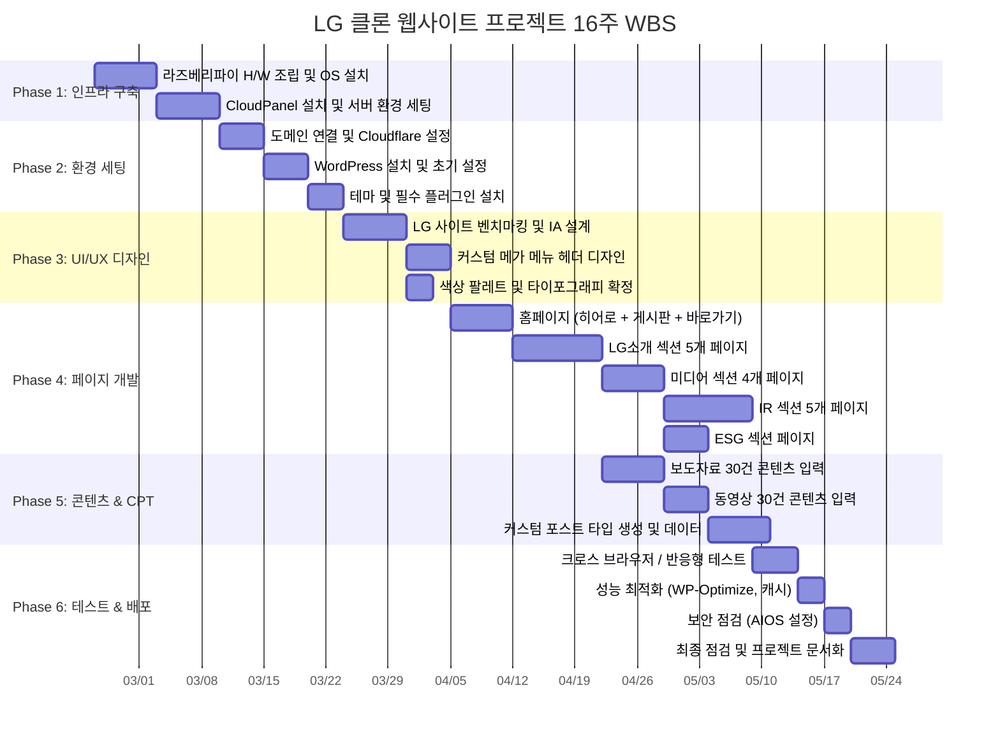

# 🏢 LG 그룹 클론 웹사이트 프로젝트 — 웹 서비스 기획서

> **프로젝트명:** LG 그룹 공식 홈페이지 클론 프로젝트  
> **버전:** v1.0  
> **작성일:** 2026-06-05  
> **작성자:** 김규태, 황주은  
> **프로젝트 기간:** 1학기 (약 16주)  
> **대상 URL:** https://lg.kimgyutae.com/

---

## 1. 프로젝트 개요

### 1.1 프로젝트 배경

본 프로젝트는 대학 1학기(약 16주) 동안 **개인 서버 하드웨어(H/W) 구축부터 소프트웨어(S/W) 렌더링까지의 풀스택 경험**을 목표로 기획되었다. 단순히 웹 페이지를 코딩하는 것에 그치지 않고, 물리적 서버(라즈베리파이 5)를 직접 셋업하고, 리눅스 서버 운영체제를 설치·관리하며, DNS/CDN/SSL 인증서 적용, CMS 설치 및 커스터마이징, 콘텐츠 제작에 이르기까지 **인프라 → 플랫폼 → 애플리케이션 → 콘텐츠**의 전 계층을 일관되게 경험하는 데 핵심 가치를 두었다.

벤치마킹 대상으로 LG그룹 공식 홈페이지(https://www.lg.co.kr/)와 LG Careers(https://careers.lg.com/)를 선정하여, 글로벌 대기업의 정보 아키텍처(IA)와 UI/UX 수준을 학습하고, 이를 자체 서버 환경에서 재현함으로써 **기업형 웹사이트 기획·개발의 실무 역량**을 체득하는 것이 본 프로젝트의 궁극적 목적이다.

### 1.2 프로젝트 목표

| 구분 | 목표 | 세부 설명 |
|------|------|----------|
| **인프라** | 온프레미스 서버 구축 | 라즈베리파이 5를 활용한 24/7 상시 운영 가능한 웹 서버 환경 구축 |
| **플랫폼** | CMS 기반 웹 운영 | WordPress CMS + CloudPanel 기반의 효율적 서버 관리 체계 확립 |
| **보안** | 엔터프라이즈급 보안 | Cloudflare를 통한 DNS 관리, CDN 적용, SSL 인증서 발급 및 DDoS 방어 |
| **프론트엔드** | 기업급 UI/UX 구현 | LG그룹·LG Careers 디자인 벤치마킹을 통한 고급 프론트엔드 인터랙션 구현 |
| **콘텐츠** | 실제 기업 수준의 IA 설계 | 5개 대메뉴, 20+개 하위 페이지, 60+개 포스트, 4개 커스텀 포스트 타입 운영 |
| **학습** | 풀스택 역량 체득 | H/W → OS → 서버 → CMS → 디자인 → 배포까지의 End-to-End 경험 축적 |

### 1.3 프로젝트 범위

```
┌─────────────────────────────────────────────────────────┐
│                    프로젝트 범위                          │
├─────────────────────────────────────────────────────────┤
│ ✅ 포함 (In-Scope)                                      │
│   • 라즈베리파이 5 서버 H/W 조립 및 OS 설치               │
│   • CloudPanel 설치 및 서버 관리 환경 세팅                │
│   • Cloudflare DNS/CDN/SSL 연동                          │
│   • WordPress CMS 설치 및 설정                           │
│   • Blocksy 테마 + Elementor 페이지 빌더 기반 디자인      │
│   • 25개 페이지 (프론트엔드) 개발                        │
│   • 61개 게시글 (보도자료, 동영상) 콘텐츠 제작            │
│   • 4개 커스텀 포스트 타입 (영업보고서, 감사보고서 등) 구현│
│   • 커스텀 CSS/JS를 통한 메가 메뉴, 스크롤 인터랙션 등    │
│   • 반응형 웹 디자인 (데스크톱/태블릿/모바일)             │
│   • 법적 고지 페이지 (개인정보처리방침, 이용약관 등)       │
├─────────────────────────────────────────────────────────┤
│ ❌ 제외 (Out-of-Scope)                                   │
│   • 실제 채용 시스템 구축 (LG Careers 외부 링크 연결)     │
│   • 실시간 주가 연동 시스템                               │
│   • 회원 가입/로그인 시스템 (관리자 전용)                 │
│   • 다국어(영문) 페이지                                   │
│   • 네이티브 모바일 앱                                    │
└─────────────────────────────────────────────────────────┘
```

---

## 2. 타겟 유저 및 벤치마킹 전략

### 2.1 타겟 유저 분석

본 사이트의 1차 타겟은 **프로젝트 평가자(교수, 멘토)** 이며, 2차 타겟은 **포트폴리오 열람자(채용 담당자, 동료 개발자)** 이다.

| 타겟 구분 | 페르소나 | 핵심 니즈 |
|-----------|---------|----------|
| 1차 타겟 | 과목 교수 / 프로젝트 심사위원 | 인프라 구축 역량, 기술 스택 이해도, 완성도 평가 |
| 2차 타겟 | IT 기업 채용 담당자 | 실무 수준의 포트폴리오, 문제 해결 능력 확인 |
| 3차 타겟 | 동료 학생 / 개발자 커뮤니티 | 유사 프로젝트 참고, 기술 벤치마킹 |

### 2.2 벤치마킹 전략: LG그룹 × LG Careers 융합

본 프로젝트의 핵심 전략은 **두 개의 LG 공식 웹사이트를 교차 벤치마킹**하여 최적의 사용자 경험을 설계하는 것이다.

#### 2.2.1 LG그룹 공식 홈페이지 (https://www.lg.co.kr/) — 콘텐츠 및 정보 구조

| 벤치마킹 요소 | 적용 내용 |
|--------------|----------|
| 정보 아키텍처(IA) | 5개 대분류(LG소개, 미디어, ESG, IR, 채용) 기반 메뉴 구조 차용 |
| 콘텐츠 유형 | ESG 소식, 보도자료, 동영상, IR 자료 등 실제 기업 콘텐츠 구조 반영 |
| 푸터 법적 고지 | 개인정보처리방침, 이용약관, 법적고지, 이메일무단수집거부 페이지 구성 |
| 바로가기 섹션 | LG사이언스파크, LG유튜브, LG×구겐하임 등 외부 링크 카드 그리드 |

#### 2.2.2 LG Careers (https://careers.lg.com/) — UI/UX 스타일 및 에스테틱

| 벤치마킹 요소 | 적용 내용 |
|--------------|----------|
| 디자인 톤앤매너 | 깔끔하고 기업적인 화이트 베이스 + LG 브랜드 컬러(#A50034) 포인트 |
| 헤더 인터랙션 | 메가 메뉴: 호버 시 65px → 320px 확장, 서브메뉴 fade-in 효과 |
| 스크롤 경험 | 도트 네비게이션(좌측 고정), 풀 페이지 스크롤 섹션 전환 |
| 카드 UI | 이미지 배경 카드 + 그라데이션 오버레이 + 호버 확대(scale 1.15) |
| 타이포그래피 | Noto Sans KR 기반, 깔끔한 한글 웹폰트 적용 |

### 2.3 차별화 포인트



---

## 3. 시스템 아키텍처 및 기술 스택

### 3.1 시스템 아키텍처 다이어그램



### 3.2 기술 스택 상세

#### 3.2.1 하드웨어 (H/W)

| 구성 요소 | 사양 | 선정 사유 |
|-----------|------|----------|
| **메인 보드** | Raspberry Pi 5 | ARM 아키텍처 기반 저전력·소형 서버, 교육용 풀스택 경험에 최적 |
| **프로세서** | Broadcom BCM2712 (Cortex-A76, 4코어 2.4GHz) | WordPress + Nginx 운영에 충분한 연산 성능 |
| **메모리** | LPDDR4X (4GB 또는 8GB) | CMS + DB 동시 운영을 위한 적정 메모리 |
| **스토리지** | microSD / NVMe SSD (M.2 HAT) | OS 및 WordPress 파일시스템 저장 |
| **네트워크** | Gigabit Ethernet + Wi-Fi 6 | 유선 서버 운영 + 무선 백업 연결 |
| **전원** | USB-C PD 27W | 24/7 상시 운영을 위한 안정적 전원 공급 |

#### 3.2.2 소프트웨어 (S/W) 스택

| 레이어 | 기술 | 버전 | 역할 |
|--------|------|------|------|
| **OS** | Raspberry Pi OS (Debian 기반) | Bookworm 64-bit | 서버 운영체제 |
| **서버 관리** | CloudPanel | 최신 | 웹 서버·DB·도메인 통합 관리 GUI 패널 |
| **웹 서버** | Nginx | 최신 안정 버전 | 정적 파일 서빙, 리버스 프록시 |
| **런타임** | PHP | 8.x | WordPress 코어 실행 환경 |
| **DB** | MySQL / MariaDB | 최신 | 콘텐츠·설정·사용자 데이터 저장 |
| **CMS** | WordPress | 7.0 | 콘텐츠 관리 시스템 코어 |
| **테마** | Blocksy | 2.1.40 | 가볍고 커스터마이징 용이한 블록 기반 테마 |
| **페이지 빌더** | Elementor | 4.0.7 | 드래그 앤 드롭 방식의 비주얼 페이지 빌더 |
| **DNS/CDN** | Cloudflare | — | DNS 레코드 관리, CDN 캐싱, SSL 발급, DDoS 방어 |
| **보안** | AIOS (All-In-One Security) | 5.4.7 | WordPress 보안 강화 (로그인 보호, 방화벽) |
| **백업** | UpdraftPlus | 1.26.3 | 자동/수동 백업 및 복원 |
| **최적화** | WP-Optimize | 4.5.3 | DB 정리, CSS/JS 미니파이, 캐시 관리 |

### 3.3 기술 스택 선정 배경

#### 라즈베리파이 5 선정 사유
- **교육적 가치**: 서버 하드웨어를 직접 다룸으로써 인프라 계층에 대한 실무적 이해 체득
- **비용 효율**: 클라우드 호스팅(AWS, GCP) 대비 초기 비용만으로 16주간 무료 운영
- **저전력 24/7 운영**: 약 15W 소비전력으로 연간 전기료 부담 미미
- **실제 서버 운영 경험**: 네트워크 설정, 포트 포워딩, 방화벽, SSL 등 실서버 운영 경험 축적

#### CloudPanel 선정 사유
- **올인원 관리**: Nginx, PHP, MySQL, Let's Encrypt 인증서 관리를 하나의 GUI로 통합
- **경량화**: cPanel 대비 메모리 사용량이 적어 라즈베리파이 환경에 적합
- **무료 오픈소스**: 비용 부담 없이 엔터프라이즈급 서버 관리 기능 제공

#### Cloudflare 선정 사유
- **DNS 관리**: 도메인(kimgyutae.com)의 서브도메인(lg.kimgyutae.com) DNS 레코드 관리
- **CDN**: 라즈베리파이의 제한된 대역폭을 Cloudflare 글로벌 캐시로 보완
- **SSL/TLS**: 무료 SSL 인증서 + Flexible/Full(Strict) 모드로 HTTPS 강제 적용
- **DDoS 방어**: 프리 티어에서도 기본 DDoS 방어 제공
- **Cloudflare Tunnel**: 포트 포워딩 없이 안전하게 로컬 서버를 인터넷에 노출
- **Web Analytics**: 무료 분석 도구(Cloudflare Beacon) 내장

#### WordPress + Blocksy + Elementor 선정 사유
- **WordPress**: 전 세계 CMS 시장 점유율 1위, 방대한 플러그인 생태계, 빠른 프로토타이핑
- **Blocksy 테마**: 가볍고(< 50KB CSS), Elementor와 최적 호환, 헤더/푸터 커스터마이징 자유도 높음
- **Elementor**: 코딩 없이 복잡한 레이아웃 구현 가능, 커스텀 CSS/JS 삽입 지원으로 고급 인터랙션 구현

---

## 4. 프로젝트 일정: 16주 마일스톤 및 WBS

### 4.1 마일스톤 개요



### 4.2 WBS 상세 (Work Breakdown Structure)

#### Phase 1: 인프라 구축 (Week 1~2)

| WBS ID | 작업명 | 산출물 | 기간 |
|--------|--------|--------|------|
| 1.1 | 라즈베리파이 5 개봉 및 조립 | 동작 확인된 H/W 셋업 | 1일 |
| 1.2 | Raspberry Pi OS 설치 (64-bit Bookworm) | 부팅 가능한 OS 환경 | 1일 |
| 1.3 | 기본 보안 설정 (SSH 키, 방화벽, 사용자 계정) | 보안 강화된 서버 | 2일 |
| 1.4 | 고정 IP 설정 및 라우터 포트 포워딩 | 외부 접근 가능한 서버 | 1일 |
| 1.5 | CloudPanel 설치 | 웹 기반 서버 관리 패널 | 2일 |
| 1.6 | Nginx + PHP + MariaDB 환경 확인 | LEMP 스택 동작 확인 | 1일 |
| 1.7 | 도메인(kimgyutae.com) 서브도메인 생성 | lg.kimgyutae.com 활성화 | 1일|

#### Phase 2: 환경 세팅 (Week 3~4)

| WBS ID | 작업명 | 산출물 | 기간 |
|--------|--------|--------|------|
| 2.1 | Cloudflare 계정 생성 및 도메인 등록 | DNS 관리 이관 완료 | 1일 |
| 2.2 | Cloudflare DNS 레코드 설정 (A/CNAME) | 서브도메인 DNS 연결 | 1일 |
| 2.3 | Cloudflare SSL/TLS 설정 (Full Strict) | HTTPS 적용 완료 | 1일 |
| 2.4 | Cloudflare CDN 및 캐시 규칙 설정 | CDN 동작 확인 | 1일 |
| 2.5 | Cloudflare Tunnel 설정 (선택) | 포트 포워딩 대체 터널 | 1일 |
| 2.6 | WordPress 설치 (CloudPanel 통합) | WP 초기 화면 확인 | 1일 |
| 2.7 | WordPress 일반 설정 (사이트명, 언어, 시간대) | 기본 설정 완료 | 0.5일 |
| 2.8 | 퍼머링크(고유주소) 설정 (Post name) | SEO 친화 URL 구조 | 0.5일 |
| 2.9 | Blocksy 테마 설치 및 활성화 | 테마 적용 완료 | 0.5일 |
| 2.10 | Elementor 설치 및 기본 설정 | 페이지 빌더 준비 | 0.5일 |
| 2.11 | 필수 플러그인 9종 설치 및 활성화 | 플러그인 스택 구성 | 2일 |

#### Phase 3: UI/UX 디자인 (Week 5~6)

| WBS ID | 작업명 | 산출물 | 기간 |
|--------|--------|--------|------|
| 3.1 | LG 공식 사이트 IA 분석 및 사이트맵 설계 | 사이트맵 문서 | 3일 |
| 3.2 | LG Careers 디자인 패턴 분석 | 디자인 레퍼런스 문서 | 2일 |
| 3.3 | 색상 팔레트 확정 (#A50034, #820029, #000, #333, #EEE, #FFF) | 디자인 시스템 | 1일 |
| 3.4 | 타이포그래피 확정 (Noto Sans KR, Google Fonts) | 폰트 스택 | 0.5일 |
| 3.5 | 커스텀 메가 메뉴 헤더 CSS/HTML 구현 | 반응형 메가 메뉴 | 5일 |
| 3.6 | Blocksy 테마 커스터마이저 설정 (헤더/푸터 레이아웃) | 테마 설정 완료 | 2일|
| 3.7 | 파비콘 및 로고 이미지 준비 (LG_logo_red, LG_logo_basic) | 브랜드 에셋 | 1일 |

#### Phase 4: 페이지 개발 (Week 7~12)

| WBS ID | 작업명 | 산출물 | 기간 |
|--------|--------|--------|------|
| 4.1 | 홈페이지: 히어로 영상 섹션 (비디오 백그라운드) | 영상 히어로 완성 | 2일 |
| 4.2 | 홈페이지: ESG 소식 게시판 섹션 (WP REST API 연동) | 동적 게시판 | 3일 |
| 4.3 | 홈페이지: 바로가기 카드 그리드 (6장) | 반응형 카드 그리드 | 2일 |
| 4.4 | 홈페이지: 도트 네비게이션 + 풀페이지 스크롤 JS | 스크롤 인터랙션 | 3일 |
| 4.5 | LG소개 페이지 (메인 랜딩) | 소개 랜딩 페이지 | 2일 |
| 4.6 | CI 페이지 (로고 가이드라인) | CI 페이지 | 2일 |
| 4.7 | LG Way 페이지 (경영 철학) | LG Way 페이지 | 2일 |
| 4.8 | 역사 페이지 (타임라인 인터랙션) | 타임라인 페이지 | 3일 |
| 4.9 | 주요 계열사 페이지 (로고 그리드 + 링크) | 계열사 페이지 | 2일 |
| 4.10 | LG사이언스파크 페이지 | 사이언스파크 페이지 | 2일 |
| 4.11 | ESG 소식 페이지 (카테고리별 게시판) | ESG 소식 페이지 | 2일 |
| 4.12 | 보도자료 페이지 | 보도자료 페이지 | 1일 |
| 4.13 | 동영상 페이지 (YouTube 임베드 그리드) | 동영상 페이지 | 2일 |
| 4.14 | 소셜미디어 페이지 | 소셜미디어 페이지 | 1일 |
| 4.15 | ESG 메인 페이지 | ESG 페이지 | 2일 |
| 4.16 | IR 메인 랜딩 페이지 | IR 랜딩 | 1일 |
| 4.17 | 기업지배구조 페이지 | 지배구조 페이지 | 2일 |
| 4.18 | 재무정보 페이지 (iframe 기반 데이터 표시) | 재무정보 페이지 | 3일 |
| 4.19 | 공시정보 페이지 | 공시정보 페이지 | 2일 |
| 4.20 | IR정보 페이지 (영업/감사보고서 필터링) | IR정보 페이지 | 3일 |
| 4.21 | Contact IR 페이지 | Contact IR 페이지 | 1일 |
| 4.22 | 법적 고지 4개 페이지 (개인정보처리방침, 이용약관, 법적고지, 이메일무단수집거부) | 법적 페이지 4건 | 2일 |

#### Phase 5: 콘텐츠 제작 및 CPT 구성 (Week 10~13)

| WBS ID | 작업명 | 산출물 | 기간 |
|--------|--------|--------|------|
| 5.1 | Custom Post Type UI로 CPT 4종 생성 | CPT 구조 완성 | 2일 |
| 5.2 | Advanced Custom Fields로 CPT 필드 설정 | ACF 필드 그룹 | 2일 |
| 5.3 | 보도자료 30건 콘텐츠 입력 (썸네일 + 본문) | 보도자료 콘텐츠 | 4일 |
| 5.4 | 동영상 30건 콘텐츠 입력 (YouTube 링크 + 썸네일) | 동영상 콘텐츠 | 3일 |
| 5.5 | 영업보고서 21건 데이터 입력 | 영업보고서 CPT | 2일 |
| 5.6 | 감사보고서 27건 데이터 입력 | 감사보고서 CPT | 2일 |
| 5.7 | IR정보 30건 데이터 입력 | IR정보 CPT | 2일 |

#### Phase 6: 테스트 및 배포 (Week 14~16)

| WBS ID | 작업명 | 산출물 | 기간 |
|--------|--------|--------|------|
| 6.1 | 크로스 브라우저 테스트 (Chrome, Firefox, Safari, Edge) | 테스트 결과 보고서 | 2일 |
| 6.2 | 반응형 테스트 (데스크톱, 태블릿, 모바일) | 반응형 확인 보고서 | 2일 |
| 6.3 | 성능 최적화: WP-Optimize 캐시/미니파이 설정 | 최적화 설정 완료 | 1일 |
| 6.4 | 성능 최적화: 이미지 WebP 변환 및 Lazy Loading | 이미지 최적화 | 1일 |
| 6.5 | 보안 점검: AIOS 설정 (로그인 URL 변경, 브루트포스 방어) | 보안 설정 완료 | 1일 |
| 6.6 | 보안 점검: Cloudflare WAF 규칙 검토 | 방화벽 설정 확인 | 0.5일 |
| 6.7 | 백업 설정: UpdraftPlus 자동 백업 스케줄 | 백업 자동화 | 0.5일 |
| 6.8 | 전체 링크 검증 및 404 페이지 확인 | 링크 상태 보고서 | 1일 |
| 6.9 | 최종 콘텐츠 리뷰 및 오탈자 점검 | 최종 점검 완료 | 2일 |
| 6.10 | 프로젝트 문서화 (기획서, SRS, 기능명세서) | 최종 산출물 | 5일 |

---

## 5. 리스크 관리

| 리스크 | 발생 확률 | 영향도 | 대응 전략 |
|--------|----------|--------|----------|
| 라즈베리파이 과열/불안정 | 중 | 상 | 방열 팬/히트싱크 장착, 온도 모니터링 스크립트 |
| 가정 네트워크 IP 변경 | 상 | 상 | Cloudflare Tunnel로 동적 IP 대응 |
| WordPress 보안 취약점 | 중 | 상 | AIOS + Cloudflare WAF + 정기 업데이트 |
| 데이터 유실 | 하 | 상 | UpdraftPlus 자동 백업 (일 1회) |
| 트래픽 급증 | 하 | 중 | Cloudflare CDN 캐시로 부하 분산 |
| 정전 | 중 | 중 | UPS 연결 또는 자동 재부팅 스크립트 |

---

## 6. 성과 지표 (KPI)

| 지표 | 목표 |
|------|------|
| 전체 페이지 수 | 25개 이상 |
| 게시글(포스트) 수 | 60건 이상 |
| 커스텀 포스트 타입 | 4개 이상 |
| 모바일 반응형 지원 | 3개 브레이크포인트 (Desktop/Tablet/Mobile) |
| Lighthouse 성능 점수 | 70점 이상 |
| SSL 인증서 적용 | HTTPS 100% |
| 서버 가동률 (16주) | 95% 이상 |
| 커스텀 CSS/JS 인터랙션 | 5개 이상 |

---

> **ⓒ 2026 LG Corp. Designed by 김규태 & 황주은.**  
> *본 문서는 lg.kimgyutae.com 프로젝트의 기획 산출물입니다.*
