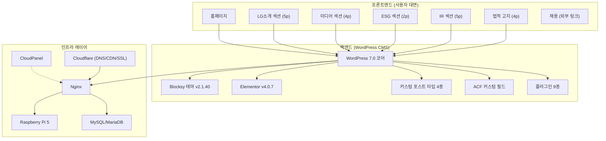
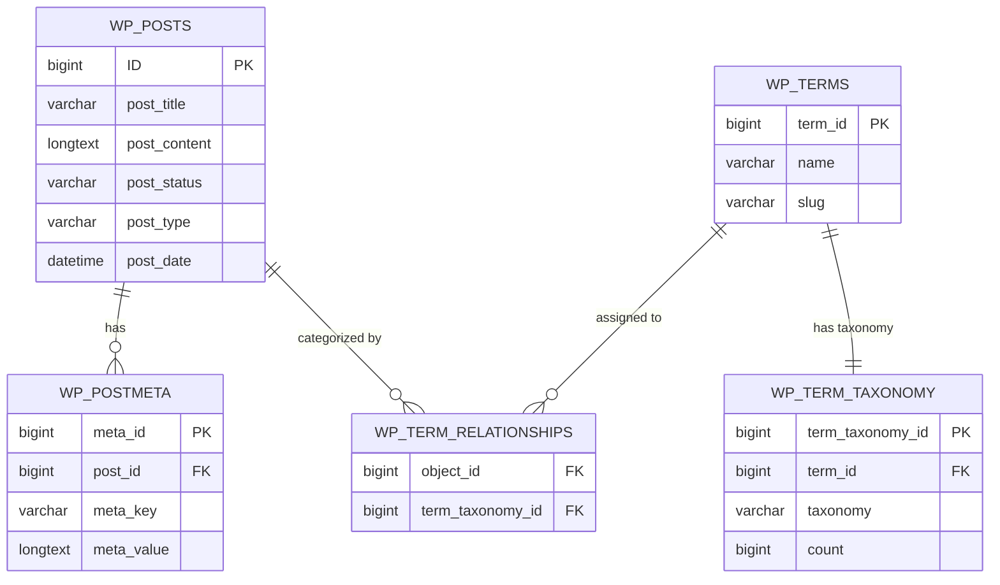

# 📋 LG 그룹 클론 웹사이트 프로젝트 — 요구사항 명세서 (SRS)

> **문서명:** Software Requirements Specification (SRS)  
> **버전:** v1.0  
> **작성일:** 2026-06-05  
> **프로젝트:** LG 그룹 공식 홈페이지 클론 (lg.kimgyutae.com)  
> **작성자:** 김규태, 황주은

---

## 1. 문서 개요

### 1.1 목적

본 문서는 LG 그룹 공식 홈페이지 클론 프로젝트(lg.kimgyutae.com)의 소프트웨어 요구사항을 체계적으로 명세하여, 프로젝트의 기능적·비기능적 요구사항 및 시스템 제약 조건을 명확히 정의하는 것을 목적으로 한다.

### 1.2 범위

본 SRS는 다음의 범위를 포함한다:
- **사용자(프론트엔드)** 측면의 기능적 요구사항
- **시스템 관리자(워드프레스 백엔드)** 측면의 기능적 요구사항
- **비기능적 요구사항** (성능, 보안, 가용성, 유지보수성)
- **시스템 요구사항** (하드웨어 명세, 소프트웨어 의존성)

### 1.3 용어 및 약어 정의

| 용어/약어 | 정의 |
|-----------|------|
| **CMS** | Content Management System, 콘텐츠 관리 시스템 (WordPress) |
| **CPT** | Custom Post Type, 워드프레스 커스텀 포스트 타입 |
| **ACF** | Advanced Custom Fields, 워드프레스 커스텀 필드 플러그인 |
| **IA** | Information Architecture, 정보 아키텍처 |
| **CDN** | Content Delivery Network, 콘텐츠 전송 네트워크 |
| **SSL/TLS** | Secure Sockets Layer / Transport Layer Security |
| **WAF** | Web Application Firewall, 웹 애플리케이션 방화벽 |
| **AIOS** | All-In-One Security, 워드프레스 통합 보안 플러그인 |
| **REST API** | Representational State Transfer API |
| **SPA** | Single Page Application (본 프로젝트에서는 해당 없음, 전통적 MPA 구조) |

### 1.4 참조 문서

| 문서명 | 설명 |
|--------|------|
| 01_웹서비스_기획서.md | 프로젝트 기획 및 아키텍처 문서 |
| 03_기능_명세서.md | 기능별 상세 명세 문서 |
| LG그룹 공식 사이트 (lg.co.kr) | 콘텐츠 및 IA 벤치마킹 대상 |
| LG Careers (careers.lg.com) | UI/UX 벤치마킹 대상 |

---

## 2. 전체 시스템 설명

### 2.1 시스템 구성도

### 2.2 사용자 유형

| 사용자 유형 | 설명 | 접근 권한 |
|------------|------|----------|
| **일반 방문자** | 프론트엔드 페이지를 탐색하는 비로그인 사용자 | 공개 페이지 읽기 전용 |
| **관리자 (Admin)** | WordPress 백엔드에 접근하여 콘텐츠 및 설정을 관리하는 사용자 | 모든 백엔드 기능 (관리자 계정) |

### 2.3 운영 환경 제약 조건

- 서버 하드웨어가 라즈베리파이 5(ARM 아키텍처)로 제한되어 있어 동시 접속자 수에 한계가 있음
- 가정용 인터넷 회선을 사용하므로 업로드 대역폭이 제한적
- Cloudflare CDN을 통해 정적 리소스를 캐싱함으로써 서버 부하를 경감
- 단일 서버 구성으로 고가용성(HA) 클러스터링은 지원하지 않음

---

## 3. 기능적 요구사항

### 3.1 사용자(프론트엔드) 측면 기능적 요구사항

#### 3.1.1 글로벌 네비게이션 (헤더)

| 요구사항 ID | 요구사항명 | 설명 | 우선순위 |
|------------|-----------|------|---------|
| **FR-FE-001** | 메가 메뉴 헤더 표시 | 모든 페이지의 상단에 5개 대분류(LG소개, 미디어, ESG, IR, 채용) 메가 메뉴를 포함한 고정 헤더를 표시해야 한다. | 상 |
| **FR-FE-002** | 메가 메뉴 호버 확장 | 사용자가 메뉴 영역에 마우스를 올리면 헤더 높이가 65px에서 320px으로 확장되며, 하위 메뉴가 fade-in 효과로 표시되어야 한다. | 상 |
| **FR-FE-003** | 브랜드 로고 홈 링크 | 좌측 상단의 LG 로고(LG_logo_red.png) + "LG" 텍스트를 클릭하면 홈페이지(/)로 이동해야 한다. | 상 |
| **FR-FE-004** | 스티키 헤더 | 사용자가 페이지를 아래로 스크롤하면 헤더가 상단에 고정(sticky)되어 항상 접근 가능해야 한다. `data-sticky="shrink"` 속성 적용. | 상 |
| **FR-FE-005** | 모바일 오프캔버스 메뉴 | 화면 너비 1200px 이하에서 햄버거 아이콘을 통해 우측에서 슬라이드되는 오프캔버스 모바일 메뉴가 표시되어야 한다. | 상 |
| **FR-FE-006** | 서브메뉴 드롭다운 (모바일) | 모바일 메뉴에서 각 대분류 항목에 드롭다운 토글 버튼(`ct-toggle-dropdown-mobile`)이 있어 하위 메뉴를 접기/펼치기 할 수 있어야 한다. | 상 |
| **FR-FE-007** | 메뉴 호버 하이라이트 | 마우스를 올린 대분류 항목의 하단에 2px 검정 보더가 나타나야 한다. 서브메뉴 링크는 호버 시 LG 레드(#A50034)로 색상이 변경되어야 한다. | 중 |
| **FR-FE-008** | 채용 메뉴 외부 링크 | "채용" 메뉴는 외부 사이트(https://careers.lg.com/)로 새 탭(`target="_blank"`)에서 열려야 한다. | 상 |

#### 3.1.2 홈페이지 (메인 페이지, page-id-838)

| 요구사항 ID | 요구사항명 | 설명 | 우선순위 |
|------------|-----------|------|---------|
| **FR-FE-010** | 투명 헤더 | 홈페이지에서만 헤더 배경이 투명하게 처리되어 히어로 영상 위에 오버레이되어야 한다. `data-transparent-row="yes"` 속성 적용. | 상 |
| **FR-FE-011** | 히어로 영상 섹션 | 첫 번째 풀스크린 섹션에 배경 영상이 자동 재생되어야 하며, 콘텐츠 영역은 padding-top: 0으로 설정되어 영상 최상단부터 표시되어야 한다. | 상 |
| **FR-FE-012** | ESG 소식 게시판 | WP REST API(`/wp-json/wp/v2/posts`)를 호출하여 "보도자료"와 "동영상" 카테고리의 최신 게시글을 썸네일 카드 형태로 동적으로 표시해야 한다. | 상 |
| **FR-FE-013** | 게시판 카드 레이아웃 | 각 게시글 카드는 썸네일 이미지, 카테고리명 뱃지, 제목을 포함해야 하며, 동영상 카테고리의 카드에는 재생 버튼 아이콘이 오버레이되어야 한다. | 상 |
| **FR-FE-014** | ESG소식 더 알아보기 링크 | 게시판 하단에 "ESG소식 더 알아보기 ↗" 링크가 있어 ESG 소식 전체 페이지로 이동할 수 있어야 한다. | 중 |
| **FR-FE-015** | 바로가기 카드 그리드 | 6개의 바로가기 카드(LG사이언스파크, LG유튜브, LG×GUGGENHEIM, 정도경영 신문고, LG공익재단, LG커리어스)가 3열 그리드로 표시되어야 한다. | 상 |
| **FR-FE-016** | 바로가기 카드 호버 효과 | 카드에 마우스를 올리면 배경 이미지가 `scale(1.15)`로 확대되고, 그라데이션 오버레이가 어두워지는 인터랙션이 적용되어야 한다. | 중 |
| **FR-FE-017** | 바로가기 카드 반응형 | 화면 너비 900px 이하에서 2열, 600px 이하에서 1열로 자동 변환되어야 한다. | 상 |
| **FR-FE-018** | 도트 네비게이션 | 좌측에 고정된 수직 도트 네비게이션이 표시되어야 하며, 현재 활성 섹션의 도트는 원형 보더(18px)로, 비활성 도트는 작은 점(3.5px)으로 표시되어야 한다. | 중 |
| **FR-FE-019** | 도트 네비게이션 색상 전환 | 최상단(히어로) 섹션에서는 도트 색상이 흰색이어야 하고, 다른 섹션에서는 검정색으로 전환되어야 한다. `top-section` 클래스로 제어. | 중 |
| **FR-FE-020** | 풀페이지 스크롤 | 마우스 휠 이벤트를 감지하여 섹션 단위로 부드럽게 스크롤(`behavior: 'smooth'`)되어야 한다. 스크롤 중 추가 입력은 무시(1.3초 딜레이). | 중 |

#### 3.1.3 LG소개 섹션 (5개 페이지)

| 요구사항 ID | 요구사항명 | 설명 | 우선순위 |
|------------|-----------|------|---------|
| **FR-FE-030** | LG소개 랜딩 페이지 | LG소개 대분류 클릭 시 랜딩 페이지가 표시되어야 하며, 하위 5개 페이지(CI, LG Way, 역사, 주요 계열사, LG사이언스파크)로의 네비게이션을 제공해야 한다. | 상 |
| **FR-FE-031** | CI 페이지 | LG 로고의 CI 가이드라인(로고 사용 규정, 색상 코드, 금지 사항 등)을 Elementor 기반으로 시각적으로 제공해야 한다. | 상 |
| **FR-FE-032** | LG Way 페이지 | LG의 경영 철학 및 핵심 가치를 Elementor 기반으로 시각적으로 구성해야 한다. | 상 |
| **FR-FE-033** | 역사 페이지 | LG의 역사를 타임라인 또는 연표 형태로 시각적으로 표현해야 하며, Elementor를 사용하여 구축한다. | 상 |
| **FR-FE-034** | 주요 계열사 페이지 | LG 그룹의 주요 계열사를 로고 그리드 또는 카드 형태로 나열하고, 각 계열사 웹사이트로의 외부 링크를 제공해야 한다. | 상 |
| **FR-FE-035** | LG사이언스파크 페이지 | LG사이언스파크의 소개 정보를 Elementor 기반으로 구성해야 한다. | 중 |

#### 3.1.4 미디어 섹션 (4개 페이지)

| 요구사항 ID | 요구사항명 | 설명 | 우선순위 |
|------------|-----------|------|---------|
| **FR-FE-040** | ESG 소식 페이지 | WordPress 포스트 중 관련 카테고리의 게시글을 카드 형태로 나열해야 한다. WP REST API를 통한 동적 콘텐츠 로딩 또는 Elementor 위젯 기반 표시. | 상 |
| **FR-FE-041** | 보도자료 페이지 | "보도자료" 카테고리의 게시글 30건을 카드 레이아웃으로 표시해야 한다. 각 카드에 썸네일, 카테고리 뱃지, 제목이 포함되어야 한다. | 상 |
| **FR-FE-042** | 동영상 페이지 | "동영상" 카테고리의 게시글 30건을 그리드 형태로 표시하며, YouTube 임베드 또는 썸네일 + 재생 아이콘 오버레이를 제공해야 한다. | 상 |
| **FR-FE-043** | 소셜미디어 페이지 | LG 그룹의 공식 소셜미디어 채널 링크 및 관련 콘텐츠를 제공해야 한다. | 중 |

#### 3.1.5 ESG 섹션 (2개 페이지)

| 요구사항 ID | 요구사항명 | 설명 | 우선순위 |
|------------|-----------|------|---------|
| **FR-FE-050** | ESG 메인 랜딩 페이지 | ESG 대분류의 랜딩 페이지로, ESG 활동 개요 및 관련 콘텐츠로의 네비게이션을 제공한다. | 상 |
| **FR-FE-051** | ESG 상세 페이지 | ESG 세부 활동 내용을 Elementor 기반으로 구성한다. | 중 |

#### 3.1.6 IR 섹션 (5개 페이지)

| 요구사항 ID | 요구사항명 | 설명 | 우선순위 |
|------------|-----------|------|---------|
| **FR-FE-060** | 기업지배구조 페이지 | LG의 기업지배구조 정보를 Elementor 기반으로 구성한다. | 상 |
| **FR-FE-061** | 재무정보 페이지 | iframe을 활용하여 재무 데이터를 표 형태로 표시해야 한다. `#ir-content-frame` iframe 컨테이너에 최소 높이 900px, 테두리 없이 임베드. IR 필터(유형/연도 드롭다운)를 통해 데이터를 필터링할 수 있어야 한다. | 상 |
| **FR-FE-062** | IR 필터 기능 | 재무정보 및 IR정보 페이지에서 유형(`#type-select`) 및 연도(`#year-select`) 드롭다운 셀렉트 박스로 데이터를 필터링할 수 있어야 한다. 셀렉트 박스 호버 시 보더 색상이 #A50034로 변경. | 상 |
| **FR-FE-063** | 공시정보 페이지 | 공시 관련 정보를 Elementor 기반으로 제공한다. | 상 |
| **FR-FE-064** | IR정보 페이지 | 커스텀 포스트 타입(ir_information) 데이터를 기반으로 영업보고서, 감사보고서 등의 IR 자료를 표시한다. 필터링 기능 포함. | 상 |
| **FR-FE-065** | Contact IR 페이지 | IR 관련 문의 연락처 정보를 제공한다. | 중 |

#### 3.1.7 푸터 영역

| 요구사항 ID | 요구사항명 | 설명 | 우선순위 |
|------------|-----------|------|---------|
| **FR-FE-070** | 푸터 3단 구성 | 푸터는 상단(로고 + 법적 링크 + 소셜), 하단(저작권 표기)의 2열 구조로 구성되어야 한다. | 상 |
| **FR-FE-071** | 푸터 로고 | 좌측에 LG 로고(LG_logo_basic.png, 100px 너비)가 표시되어야 한다. | 중 |
| **FR-FE-072** | 법적 고지 링크 | 개인정보처리방침(볼드체), 이용약관, 법적고지, 이메일무단수집거부 4개 링크가 가로 정렬로 표시되어야 한다. | 상 |
| **FR-FE-073** | 법적 고지 팝업 | 법적 고지 링크 클릭 시 600×800px 크기의 새 창(팝업)이 화면 중앙에 열려야 한다. `popupNotice()` 함수로 구현. | 상 |
| **FR-FE-074** | 소셜미디어 아이콘 | YouTube 아이콘 + 라벨이 표시되며, 클릭 시 LG 공식 YouTube 채널(https://www.youtube.com/c/LGSTORY)로 새 탭에서 이동해야 한다. | 중 |
| **FR-FE-075** | 저작권 표기 | "ⓒ 2026 LG Corp. Designed by 김규태 & 황주은." 텍스트가 하단 중앙에 표시되어야 한다. | 상 |

#### 3.1.8 공통 프론트엔드 요구사항

| 요구사항 ID | 요구사항명 | 설명 | 우선순위 |
|------------|-----------|------|---------|
| **FR-FE-080** | 반응형 웹 디자인 | 데스크톱(1025px 이상), 태블릿(768px~1024px), 모바일(767px 이하) 3개 브레이크포인트에서 적절히 레이아웃이 변환되어야 한다. | 상 |
| **FR-FE-081** | 한국어 UI | 모든 인터페이스 텍스트, 메뉴, 메시지가 한국어(ko-KR)로 표시되어야 한다. `<html lang="ko-KR">` | 상 |
| **FR-FE-082** | Noto Sans KR 폰트 | 본문 및 UI 텍스트에 Google Fonts의 "Noto Sans KR" 웹폰트가 적용되어야 한다. | 상 |
| **FR-FE-083** | 이미지 WebP 변환 | 주요 이미지 에셋은 WebP 포맷으로 변환·제공하여 로딩 속도를 최적화해야 한다. (예: LG_logo_red.png.webp) | 중 |
| **FR-FE-084** | Lazy Loading | 뷰포트 밖의 이미지 및 Elementor 섹션에 지연 로딩(Intersection Observer 기반)이 적용되어야 한다. | 중 |
| **FR-FE-085** | 스킵 네비게이션 | "본문으로 건너뛰기" 스킵 링크가 최상단에 존재하여 키보드 접근성을 보장해야 한다. | 중 |
| **FR-FE-086** | Schema.org 구조화 데이터 | 헤더(`WPHeader`), 푸터(`WPFooter`), 페이지(`WebPage`) 등에 Schema.org 마크업이 적용되어야 한다. | 하 |
| **FR-FE-087** | Prefetch 규칙 | 내부 링크에 대해 `speculationrules`를 통한 conservative prefetch가 적용되어야 한다. wp-admin, uploads 경로는 제외. | 하 |

---

### 3.2 시스템 관리자(워드프레스 백엔드) 측면 기능적 요구사항

#### 3.2.1 관리자 접근 및 인증

| 요구사항 ID | 요구사항명 | 설명 | 우선순위 |
|------------|-----------|------|---------|
| **FR-BE-001** | 커스텀 로그인 URL | 보안을 위해 워드프레스 기본 로그인 경로(wp-login.php)를 커스텀 URL(`/open_the_door`)로 변경하여 사용해야 한다. AIOS 플러그인 활용. | 상 |
| **FR-BE-002** | 관리자 계정 | admin 계정 1개를 통해 모든 백엔드 기능에 접근할 수 있어야 한다. | 상 |
| **FR-BE-003** | 회원가입 비활성화 | 일반 사용자의 회원가입을 비활성화하여 관리자만 백엔드에 접근할 수 있도록 해야 한다. (Settings > General > Membership 비활성화) | 상 |

#### 3.2.2 콘텐츠 관리

| 요구사항 ID | 요구사항명 | 설명 | 우선순위 |
|------------|-----------|------|---------|
| **FR-BE-010** | 페이지 관리 | 관리자는 25개의 워드프레스 페이지를 생성, 편집, 삭제할 수 있어야 한다. 대부분의 페이지는 Elementor 편집기를 통해 비주얼 편집이 가능해야 한다. | 상 |
| **FR-BE-011** | 포스트(게시글) 관리 | 관리자는 61건의 포스트를 생성, 편집, 삭제할 수 있어야 한다. 각 포스트에 카테고리(보도자료, 동영상) 분류와 특성이미지(썸네일) 설정이 가능해야 한다. | 상 |
| **FR-BE-012** | 카테고리 관리 | "보도자료"(30건), "동영상"(30건), "Uncategorized"(1건) 3개 카테고리를 관리할 수 있어야 한다. | 상 |
| **FR-BE-013** | 미디어 라이브러리 관리 | 이미지, 영상, PDF 등의 미디어 파일을 업로드하고 관리할 수 있어야 한다. 이미지 자동 리사이징(300px, 600px, 768px, 900px) 및 WebP 변환을 지원해야 한다. | 상 |

#### 3.2.3 커스텀 포스트 타입 (CPT) 관리

| 요구사항 ID | 요구사항명 | 설명 | 우선순위 |
|------------|-----------|------|---------|
| **FR-BE-020** | CPT 생성 도구 | Custom Post Type UI 플러그인을 통해 코드 작성 없이 GUI로 커스텀 포스트 타입을 생성·관리할 수 있어야 한다. | 상 |
| **FR-BE-021** | 영업보고서 CPT | `business_report` 슬러그의 커스텀 포스트 타입으로 21건의 영업보고서 데이터를 관리할 수 있어야 한다. 사이트맵에 자동 포함. | 상 |
| **FR-BE-022** | 감사보고서 CPT | `audit_report` 슬러그의 커스텀 포스트 타입으로 27건의 감사보고서 데이터를 관리할 수 있어야 한다. 발행/임시저장 상태 관리. | 상 |
| **FR-BE-023** | IR정보 CPT | `ir_information` 슬러그의 커스텀 포스트 타입으로 30건의 IR 자료를 관리할 수 있어야 한다. 사이트맵에 자동 포함. | 상 |
| **FR-BE-024** | 공시공고 CPT | `public_notice` 슬러그의 커스텀 포스트 타입으로 공시·공고 데이터를 관리할 수 있어야 한다. (현재 0건, 확장 대비) | 하 |
| **FR-BE-025** | ACF 커스텀 필드 | Advanced Custom Fields 플러그인을 통해 각 CPT에 필요한 커스텀 필드(첨부파일 URL, 발행 연도, 문서 유형 등)를 추가·관리할 수 있어야 한다. | 상 |

#### 3.2.4 테마 및 디자인 관리

| 요구사항 ID | 요구사항명 | 설명 | 우선순위 |
|------------|-----------|------|---------|
| **FR-BE-030** | Blocksy 테마 커스터마이저 | Blocksy 테마의 커스터마이저를 통해 헤더/푸터 레이아웃, 색상 팔레트, 타이포그래피를 설정할 수 있어야 한다. | 상 |
| **FR-BE-031** | 테마 색상 팔레트 | 8가지 테마 색상 변수를 설정할 수 있어야 한다: Color-1(#A50034, LG 레드), Color-2(#820029, 다크 레드), Color-3(#000000), Color-4(#333333), Color-5(#EEEEEE), Color-6(#FFFFFF), Color-7(#cccccc), Color-8(#ffffff) | 상 |
| **FR-BE-032** | Elementor 페이지 빌더 | 각 페이지를 Elementor 편집기로 비주얼하게 편집할 수 있어야 한다. 컨테이너(Flexbox) 레이아웃, 텍스트, 이미지, HTML 위젯, 동영상 위젯 등을 지원해야 한다. | 상 |
| **FR-BE-033** | 커스텀 CSS | WordPress 커스터마이저의 "추가 CSS" 영역에 사이트 전역에 적용되는 커스텀 CSS를 입력할 수 있어야 한다. (IR 필터 스타일, iframe 컨테이너 스타일 등) | 상 |
| **FR-BE-034** | Elementor 내 커스텀 HTML/CSS/JS | Elementor의 HTML 위젯을 통해 각 페이지에 커스텀 HTML, 인라인 CSS, JavaScript를 삽입할 수 있어야 한다. (메가 메뉴, 도트 네비게이션, REST API 호출 등) | 상 |
| **FR-BE-035** | Code Snippets 관리 | Code Snippets 플러그인을 통해 functions.php를 직접 수정하지 않고 PHP/JS 코드 스니펫을 안전하게 관리할 수 있어야 한다. | 중 |

#### 3.2.5 메뉴 관리

| 요구사항 ID | 요구사항명 | 설명 | 우선순위 |
|------------|-----------|------|---------|
| **FR-BE-040** | 헤더 메뉴 구성 | "헤더 메뉴"를 생성하여 5개 대분류(LG소개, 미디어, ESG, IR, 채용)와 16개 하위 메뉴를 구성할 수 있어야 한다. Header Menu 1 및 Mobile Menu 위치에 할당. | 상 |
| **FR-BE-041** | 푸터 메뉴 구성 | "푸터 메뉴"를 생성하여 4개 법적 고지 페이지(개인정보처리방침, 이용약관, 법적고지, 이메일무단수집거부)를 구성하고 Footer Menu 위치에 할당할 수 있어야 한다. | 상 |
| **FR-BE-042** | 메뉴 항목 유형 | 메뉴 항목으로 페이지(Page), 커스텀 링크(Custom Link), Elementor 페이지를 혼용할 수 있어야 한다. | 중 |

#### 3.2.6 플러그인 관리

| 요구사항 ID | 요구사항명 | 설명 | 우선순위 |
|------------|-----------|------|---------|
| **FR-BE-050** | 플러그인 설치/활성화 | 관리자는 9개 플러그인을 설치, 활성화, 비활성화, 삭제할 수 있어야 한다. | 상 |
| **FR-BE-051** | 플러그인 업데이트 알림 | 각 플러그인의 업데이트 가용 여부를 대시보드에서 확인할 수 있어야 한다. | 중 |

---

## 4. 비기능적 요구사항

### 4.1 성능 (Performance)

| 요구사항 ID | 요구사항명 | 설명 | 목표치 |
|------------|-----------|------|--------|
| **NFR-PE-001** | 페이지 로딩 시간 | 홈페이지 및 주요 페이지의 First Contentful Paint(FCP)가 CDN 경유 시 3초 이내여야 한다. | FCP < 3s |
| **NFR-PE-002** | 정적 리소스 캐싱 | Cloudflare CDN을 통해 CSS, JS, 이미지 등 정적 리소스가 Edge에 캐싱되어야 한다. | 캐시 적중률 > 70% |
| **NFR-PE-003** | CSS/JS 미니파이 | WP-Optimize 플러그인을 통해 CSS 및 JavaScript 파일이 미니파이(minify)되어 전송 크기가 최소화되어야 한다. | 미니파이 적용 완료 |
| **NFR-PE-004** | 이미지 최적화 | 주요 이미지는 WebP 포맷으로 제공되고, srcset 속성으로 다양한 해상도(300w, 600w, 768w, 900w)의 이미지를 반응형으로 제공해야 한다. | WebP + srcset |
| **NFR-PE-005** | Lazy Loading | 뷰포트 밖의 이미지 및 Elementor 컨테이너에 Intersection Observer 기반 지연 로딩이 적용되어야 한다. rootMargin: 200px. | Lazy Loading 적용 |
| **NFR-PE-006** | 데이터베이스 최적화 | WP-Optimize를 통해 DB 테이블 최적화, 리비전 정리, 트랜지언트 삭제 등 정기적 DB 정리가 가능해야 한다. | 주 1회 자동 최적화 |
| **NFR-PE-007** | Speculation Rules | 내부 링크에 대한 conservative prefetch를 적용하여 페이지 전환 속도를 개선해야 한다. | 규칙 적용 완료 |
| **NFR-PE-008** | 동시 접속자 처리 | 라즈베리파이 5 환경에서 최소 10명의 동시 접속자를 안정적으로 처리할 수 있어야 한다. Cloudflare CDN으로 부하 분산. | 동시 10명 이상 |

### 4.2 보안 (Security)

| 요구사항 ID | 요구사항명 | 설명 | 목표치 |
|------------|-----------|------|--------|
| **NFR-SE-001** | HTTPS 강제 적용 | Cloudflare SSL/TLS를 통해 모든 페이지에 HTTPS가 강제 적용되어야 한다. HTTP 접근 시 301 리다이렉트. | HTTPS 100% |
| **NFR-SE-002** | 커스텀 관리자 URL | AIOS 플러그인을 통해 기본 로그인 URL(`wp-login.php`)을 커스텀 URL(`/open_the_door`)로 변경하여 자동화 공격을 방어해야 한다. | 커스텀 URL 적용 |
| **NFR-SE-003** | 브루트포스 방어 | AIOS 플러그인을 통해 로그인 시도 횟수 제한, IP 차단 등 브루트포스 공격 방어가 적용되어야 한다. | 방어 정책 활성화 |
| **NFR-SE-004** | Cloudflare WAF | Cloudflare의 Web Application Firewall을 통해 OWASP Top 10 공격(SQL Injection, XSS 등)을 방어해야 한다. | WAF 규칙 활성화 |
| **NFR-SE-005** | DDoS 방어 | Cloudflare의 기본 DDoS 방어를 통해 L3/L4/L7 DDoS 공격으로부터 서버를 보호해야 한다. | DDoS 방어 활성화 |
| **NFR-SE-006** | Cloudflare Tunnel | 라즈베리파이 서버를 인터넷에 직접 노출하지 않고, Cloudflare Tunnel을 통해 안전하게 트래픽을 라우팅할 수 있어야 한다. (선택) | 터널 구성 가능 |
| **NFR-SE-007** | XML-RPC 보호 | WordPress의 XML-RPC 엔드포인트에 대한 무차별 공격을 방어해야 한다. | 보호 적용 |
| **NFR-SE-008** | 파일 편집 비활성화 | 보안을 위해 워드프레스 관리자 대시보드 내 테마/플러그인 파일 편집기를 비활성화 해야 한다. | 편집기 비활성화 |
| **NFR-SE-009** | Cloudflare Analytics | Cloudflare Web Analytics(Beacon)를 통해 사이트 트래픽 및 보안 이벤트를 모니터링할 수 있어야 한다. 토큰 기반 비콘 삽입. | 모니터링 활성화 |

### 4.3 가용성 (Availability)

| 요구사항 ID | 요구사항명 | 설명 | 목표치 |
|------------|-----------|------|--------|
| **NFR-AV-001** | 서버 가동률 | 16주 프로젝트 기간 중 서버 가동률이 95% 이상이어야 한다. (계획된 유지보수 시간 제외) | 95% uptime |
| **NFR-AV-002** | 자동 백업 | UpdraftPlus 플러그인을 통해 WordPress 파일 및 데이터베이스의 자동 백업이 최소 일 1회 수행되어야 한다. | 일 1회 백업 |
| **NFR-AV-003** | 백업 복원 | UpdraftPlus를 통해 백업 데이터로부터 전체 사이트를 복원할 수 있어야 한다. 복원 소요 시간 30분 이내. | 복원 < 30분 |
| **NFR-AV-004** | 정전 복구 | 라즈베리파이가 정전 후 전원 복구 시 자동으로 부팅되어 웹 서버가 재시작되어야 한다. | 자동 재시작 |
| **NFR-AV-005** | Cloudflare Always Online | Cloudflare의 Always Online 기능을 통해 원본 서버 다운 시 캐시된 버전의 페이지를 제공할 수 있어야 한다. | 캐시 페이지 제공 |

### 4.4 유지보수성 (Maintainability)

| 요구사항 ID | 요구사항명 | 설명 | 우선순위 |
|------------|-----------|------|---------|
| **NFR-MA-001** | WordPress 코어 업데이트 | WordPress 코어 버전(현재 7.0)을 관리자 대시보드에서 원클릭으로 업데이트할 수 있어야 한다. | 상 |
| **NFR-MA-002** | 플러그인 업데이트 | 9개 플러그인의 업데이트를 관리자 대시보드에서 개별 또는 일괄적으로 수행할 수 있어야 한다. | 상 |
| **NFR-MA-003** | 테마 업데이트 | Blocksy 테마(현재 v2.1.40) 업데이트를 관리자 대시보드에서 수행할 수 있어야 한다. | 상 |
| **NFR-MA-004** | CloudPanel 관리 GUI | CloudPanel을 통해 Nginx 설정, PHP 버전, MySQL 관리, SSL 인증서 갱신 등을 GUI로 관리할 수 있어야 한다. | 상 |
| **NFR-MA-005** | 콘텐츠 확장성 | 추가 페이지, 포스트, CPT 데이터를 관리자가 코딩 없이 추가할 수 있어야 한다. | 상 |
| **NFR-MA-006** | Code Snippets 관리 | 커스텀 PHP/JS 코드를 Code Snippets 플러그인으로 개별 관리하여, functions.php 직접 수정 없이 안전하게 코드 변경이 가능해야 한다. | 중 |
| **NFR-MA-007** | DB 정리 자동화 | WP-Optimize를 통해 포스트 리비전, 자동 임시 저장, 스팸 댓글 등을 자동으로 정리할 수 있어야 한다. | 중 |

---

## 5. 시스템 요구사항

### 5.1 하드웨어 (H/W) 명세

| 구성 요소 | 최소 사양 | 권장 사양 (본 프로젝트 적용) |
|-----------|----------|---------------------------|
| **보드** | Raspberry Pi 4 Model B | **Raspberry Pi 5** |
| **프로세서** | Cortex-A72 4코어 1.8GHz | **Cortex-A76 4코어 2.4GHz** |
| **메모리** | 2GB LPDDR4 | **4GB~8GB LPDDR4X** |
| **스토리지** | 32GB microSD (Class 10) | **64GB+ microSD 또는 NVMe SSD (M.2 HAT)** |
| **네트워크** | 100Mbps Ethernet | **Gigabit Ethernet + Wi-Fi 6** |
| **전원** | USB-C 5V 3A (15W) | **USB-C PD 5V 5A (27W)** |
| **냉각** | 패시브 히트싱크 | **액티브 팬 + 히트싱크** |
| **케이스** | 오픈형 | **밀폐형 케이스 (방열 설계)** |

### 5.2 소프트웨어 (S/W) 의존성

#### 5.2.1 서버 운영체제 및 미들웨어

| S/W | 최소 버전 | 본 프로젝트 버전 | 역할 |
|-----|----------|----------------|------|
| Raspberry Pi OS (64-bit) | Bookworm | **Bookworm 64-bit** | ARM64 Linux 서버 운영체제 |
| CloudPanel | 2.x | **최신 안정 버전** | 웹 서버 통합 관리 패널 |
| Nginx | 1.18+ | **최신 안정 버전** | 웹 서버 (리버스 프록시, 정적 파일 서빙) |
| PHP | 8.0+ | **8.x (CloudPanel 제공)** | WordPress 코어 실행 환경 |
| MySQL / MariaDB | 5.7+ / 10.4+ | **최신 안정 버전** | 관계형 데이터베이스 |

#### 5.2.2 WordPress 코어 및 테마

| S/W | 버전 | 역할 |
|-----|------|------|
| WordPress | **7.0** | CMS 코어 엔진 |
| Blocksy 테마 | **2.1.40** | 메인 프론트엔드 테마 (경량, Elementor 호환) |
| Blocksy Companion | **2.1.40** | Blocksy 테마 확장 기능 (스티키 헤더, 오프캔버스 등) |
| Twenty Twenty-Five | 최신 | 비활성 대체 테마 (비상용) |

#### 5.2.3 WordPress 플러그인 (총 9종, 전량 활성)

| # | 플러그인명 | 버전 | 카테고리 | 핵심 역할 |
|---|-----------|------|---------|----------|
| 1 | **Advanced Custom Fields (ACF)** | 6.8.0 | 콘텐츠 확장 | CPT에 커스텀 필드(첨부파일, 연도 등) 추가 |
| 2 | **All-In-One Security (AIOS)** | 5.4.7 | 보안 | 로그인 URL 변경, 브루트포스 방어, 방화벽 |
| 3 | **Blocksy Companion** | 2.1.40 | 테마 확장 | 스티키 헤더, 오프캔버스 메뉴, 소셜 아이콘 등 |
| 4 | **Code Snippets** | 3.9.6 | 개발 도구 | functions.php 대체 PHP/JS 코드 관리 |
| 5 | **Custom Post Type UI** | 1.19.1 | 콘텐츠 확장 | GUI로 커스텀 포스트 타입 4종 생성·관리 |
| 6 | **Elementor** | 4.0.7 | 페이지 빌더 | 드래그 앤 드롭 비주얼 페이지 빌더 |
| 7 | **Essential Addons for Elementor** | 6.6.3 | 페이지 빌더 확장 | Elementor 추가 위젯 및 기능 |
| 8 | **UpdraftPlus - 백업/복원** | 1.26.3 | 유지보수 | 자동/수동 백업 및 원클릭 복원 |
| 9 | **WP-Optimize - 정리, 압축, 캐시** | 4.5.3 | 성능 최적화 | DB 정리, CSS/JS 미니파이, 페이지 캐시 |

#### 5.2.4 외부 서비스 의존성

| 서비스 | 플랜 | 역할 | 필수 여부 |
|--------|------|------|----------|
| **Cloudflare** | Free (무료) | DNS 관리, CDN, SSL/TLS, DDoS 방어, WAF, Web Analytics | 필수 |
| **Google Fonts** | 무료 | Noto Sans KR 웹폰트 호스팅 | 필수 |
| **Font Awesome CDN** | 무료 | 아이콘 폰트 (바로가기 카드 chevron 아이콘 등) | 선택 |
| **YouTube** | 무료 | 동영상 콘텐츠 호스팅 (임베드) | 선택 |
| **도메인 레지스트라** | 유료 | kimgyutae.com 도메인 등록 및 갱신 | 필수 |

#### 5.2.5 클라이언트 측 의존성

| 라이브러리 | 버전 | 역할 |
|-----------|------|------|
| jQuery | 3.7.1 | WordPress 코어 JavaScript 라이브러리 |
| jQuery Migrate | 3.4.1 | jQuery 구버전 호환성 레이어 |
| jQuery UI Core | 1.13.3 | jQuery UI 코어 모듈 |
| Swiper | 최신 (Elementor 내장) | 카르셀/슬라이더 (Elementor 사용) |
| Font Awesome | 6.4.0 | 아이콘 폰트 (CDN via cdnjs.cloudflare.com) |

### 5.3 네트워크 요구사항

| 항목 | 요구사항 |
|------|---------|
| **인터넷 회선** | 가정용 광대역 인터넷 (최소 업로드 10Mbps 이상 권장) |
| **고정 IP / 동적 DNS** | Cloudflare Tunnel 또는 DDNS 서비스를 통해 동적 IP 환경 대응 |
| **포트** | 80 (HTTP → Cloudflare), 443 (HTTPS → Cloudflare), 8443 (CloudPanel 관리) |
| **방화벽** | UFW 또는 iptables로 불필요한 포트 차단, Cloudflare IP만 허용 |
| **도메인** | kimgyutae.com 도메인 소유, lg 서브도메인(lg.kimgyutae.com) 설정 |

### 5.4 브라우저 호환성 요구사항

| 브라우저 | 최소 지원 버전 | 비고 |
|---------|--------------|------|
| Google Chrome | 90+ | 주요 대상 브라우저 |
| Mozilla Firefox | 88+ | 크로스 브라우저 호환 |
| Apple Safari | 14+ | macOS/iOS 사용자 대응 |
| Microsoft Edge | 90+ | Chromium 기반 |
| Samsung Internet | 14+ | 모바일 사용자 대응 |
| Internet Explorer | 미지원 | 지원 종료 브라우저 |

---

## 6. 인터페이스 요구사항

### 6.1 사용자 인터페이스 (UI)

| 요구사항 ID | 설명 |
|------------|------|
| **IR-UI-001** | 모든 페이지는 일관된 헤더(메가 메뉴) + 콘텐츠 + 푸터 3단 레이아웃을 따라야 한다. |
| **IR-UI-002** | LG 브랜드 가이드라인에 따른 색상 팔레트(Primary: #A50034, Secondary: #820029, Black: #000, Gray: #333, Light: #EEE, White: #FFF)를 일관되게 사용해야 한다. |
| **IR-UI-003** | 모든 인터랙티브 요소(버튼, 링크, 카드)에 호버 효과(색상 변경, 트랜지션 0.2~0.4s)가 적용되어야 한다. |
| **IR-UI-004** | 폰트 크기는 clamp() 함수를 활용하여 뷰포트에 따라 유동적으로 조절되어야 한다. |

### 6.2 외부 시스템 인터페이스

| 요구사항 ID | 설명 |
|------------|------|
| **IR-EX-001** | WordPress REST API(`/wp-json/wp/v2/posts`)를 통해 프론트엔드 JavaScript에서 게시글 데이터를 비동기적으로 조회할 수 있어야 한다. |
| **IR-EX-002** | Cloudflare DNS API를 통해 도메인 레코드가 자동 갱신되어야 한다. (Cloudflare Tunnel 사용 시) |
| **IR-EX-003** | Google Fonts API를 통해 Noto Sans KR 폰트를 동적으로 로딩해야 한다. |
| **IR-EX-004** | Font Awesome CDN(cdnjs.cloudflare.com)을 통해 아이콘 폰트를 로딩해야 한다. |

---

## 7. 데이터 요구사항

### 7.1 데이터 모델 개요

### 7.2 콘텐츠 데이터 통계

| 데이터 유형 | Post Type | 총 건수 | 상태 |
|------------|-----------|--------|------|
| 페이지 (Page) | `page` | 25건 | 전량 Published |
| 게시글 (Post) | `post` | 61건 | 전량 Published |
| 영업보고서 | `business_report` | 21건 | 전량 Published |
| 감사보고서 | `audit_report` | 27건 | 26건 Published, 1건 Draft |
| IR정보 | `ir_information` | 30건 | 전량 Published |
| 공시공고 | `public_notice` | 0건 | 확장 대비 |
| **합계** | — | **164건** | — |

### 7.3 카테고리 구조

| 카테고리명 | 슬러그 | 포스트 수 | 용도 |
|-----------|--------|----------|------|
| 보도자료 | `보도자료` | 30건 | 언론 보도자료 아카이브 |
| 동영상 | `동영상` | 30건 | YouTube 영상 콘텐츠 아카이브 |
| Uncategorized | `uncategorized` | 1건 | WordPress 기본 카테고리 |

---

## 8. 제약 조건 및 가정

### 8.1 제약 조건

| 제약 ID | 설명 |
|---------|------|
| **CON-001** | 서버 하드웨어가 Raspberry Pi 5로 한정되어 있어, 고트래픽 환경에서의 성능은 Cloudflare CDN에 의존한다. |
| **CON-002** | 프로젝트 기간이 1학기(16주)로 제한되어 있어, 회원 시스템, 결제 시스템, 다국어 지원 등의 확장 기능은 범위에서 제외한다. |
| **CON-003** | 가정용 인터넷 회선을 사용하므로 업로드 대역폭에 제한이 있다. |
| **CON-004** | 단일 서버 구성으로 고가용성(HA) 및 로드 밸런싱은 지원하지 않는다. |
| **CON-005** | WordPress 생태계(테마, 플러그인)에 의존하므로, 플러그인 호환성 이슈 발생 가능성이 있다. |

### 8.2 가정

| 가정 ID | 설명 |
|---------|------|
| **ASM-001** | 프로젝트 기간 동안 가정 인터넷 회선이 안정적으로 유지된다. |
| **ASM-002** | Cloudflare 무료 플랜이 프로젝트 기간 동안 현재 기능을 유지한다. |
| **ASM-003** | 라즈베리파이 5 하드웨어가 프로젝트 기간 동안 정상 동작한다. |
| **ASM-004** | WordPress 7.0 및 플러그인이 프로젝트 기간 동안 호환성을 유지한다. |
| **ASM-005** | 프로젝트 콘텐츠(이미지, 텍스트)는 LG그룹 공식 사이트를 참고하여 교육 목적으로만 사용된다. |

---

> **ⓒ 2026 LG Corp. Designed by 김규태 & 황주은.**  
> *본 문서는 lg.kimgyutae.com 프로젝트의 요구사항 명세 산출물입니다.*
