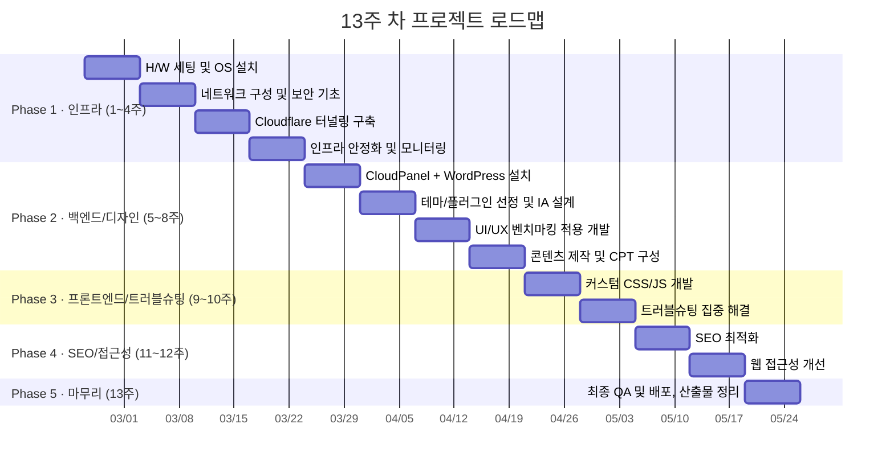

# 🎓 LG 그룹 클론 프로젝트 — 13주 차 종합 발표 기획서

> **프로젝트:** LG 그룹 공식 홈페이지 클론 (lg.kimgyutae.com)  
> **작성일:** 2026-06-05  
> **작성자:** 김규태, 황주은  
> **용도:** 최종 발표 준비 및 프로젝트 회고 종합 문서

---

# Part 1. 13주 차 웹 개발 전체 프로세스 플랜

## 📅 전체 로드맵 개요



---

## 🗓️ Week 1 — 서버 하드웨어 세팅

### 목표
라즈베리파이 5를 웹 서버용 하드웨어로 조립하고, 운영체제를 설치하여 기본 동작을 확인한다.

### 주요 작업

| # | 작업 | 상세 내용 | 산출물 |
|---|------|----------|--------|
| 1 | 라즈베리파이 5 개봉/조립 | Cortex-A76 4코어 2.4GHz, 8GB LPDDR4X. 액티브 팬 + 히트싱크 장착. 밀폐형 케이스 조립. | H/W 조립 완료 사진 |
| 2 | microSD / NVMe SSD 준비 | Raspberry Pi Imager로 Raspberry Pi OS (64-bit Bookworm) 이미지 플래싱 | 부팅 가능한 스토리지 |
| 3 | OS 설치 및 초기 부팅 | 첫 부팅 → locale(ko_KR.UTF-8), timezone(Asia/Seoul) 설정. SSH 서버 활성화. | 초기 설정 완료 스크린샷 |
| 4 | 기본 패키지 업데이트 | `sudo apt update && sudo apt upgrade -y` → 최신 보안 패치 적용 | 패키지 리스트 로그 |

### 핵심 학습 포인트
> "왜 AWS나 가비아 같은 클라우드 호스팅 대신 라즈베리파이를 선택했는가?"  
> → 약 15W 소비전력으로 연간 전기료 ₩15,000 미만. 16주 프로젝트 비용: H/W 1회 구매(~₩100,000) vs 클라우드 월 ₩10,000×4 = ₩40,000. 비용뿐 아니라 **물리 서버 레벨의 인프라 경험**(네트워크 설정, 포트 포워딩, 전원 관리)은 클라우드에서 얻을 수 없는 학습 가치.

---

## 🗓️ Week 2 — 네트워크 구성 및 보안 기초

### 목표
라즈베리파이를 외부에서 접근 가능한 웹 서버로 만들기 위한 네트워크 인프라를 구성한다.

### 주요 작업

| # | 작업 | 상세 내용 | 산출물 |
|---|------|----------|--------|
| 1 | 고정 내부 IP 설정 | `/etc/dhcpcd.conf` 또는 NetworkManager로 라즈베리파이에 고정 내부 IP(예: 192.168.0.100) 할당 | 네트워크 설정 파일 |
| 2 | 라우터 포트 포워딩 | 라우터 관리자에서 80(HTTP), 443(HTTPS) → 192.168.0.100으로 포워딩 | 라우터 설정 캡처 |
| 3 | 방화벽(UFW) 설정 | `ufw allow 80,443/tcp` → 필요 포트만 개방. SSH는 키 기반 인증으로 전환 | UFW 규칙 목록 |
| 4 | SSH 키 기반 인증 | 비밀번호 인증 비활성화, ed25519 키페어 기반 접속만 허용 | SSH 설정 파일 |
| 5 | fail2ban 설치 | SSH 브루트포스 공격 방어. 5회 실패 시 10분 IP 차단 | fail2ban 설정 |

### 핵심 학습 포인트
> 가정용 인터넷의 **동적 IP 문제**를 인지. 공유기 재부팅이나 ISP 정책에 의해 공인 IP가 변경되면 서버 접근 불가. → 이 문제는 3주 차 Cloudflare 터널로 해결 예정.

---

## 🗓️ Week 3 — Cloudflare 터널링 구축

### 목표
Cloudflare를 통해 DNS, CDN, SSL, DDoS 방어를 한 번에 해결하고, Cloudflare Tunnel로 동적 IP 문제를 근본적으로 해결한다.

### 주요 작업

| # | 작업 | 상세 내용 | 산출물 |
|---|------|----------|--------|
| 1 | 도메인 Cloudflare 연동 | kimgyutae.com 네임서버를 Cloudflare로 변경 | DNS 설정 스크린샷 |
| 2 | 서브도메인 생성 | lg.kimgyutae.com A/CNAME 레코드 생성. Proxy(🟠) 모드 활성화 | DNS 레코드 목록 |
| 3 | **Cloudflare Tunnel 설치** | `cloudflared` 데몬 설치 → `cloudflared tunnel create lg-tunnel` → 토큰 기반 연결 | 터널 구성 YAML |
| 4 | SSL/TLS 설정 | Full (Strict) 모드 활성화. 최소 TLS 1.2. Always Use HTTPS 활성화 | SSL 설정 캡처 |
| 5 | CDN 캐시 정책 | 정적 리소스(CSS/JS/이미지) 캐시 수준: Standard. 브라우저 캐시 TTL: 4시간 | 캐시 규칙 설정 |

### ⚠️ 트러블슈팅 예고: Error 1033
> 이 시점에서 **Cloudflare Error 1033 ("Argo Tunnel Error")**이 간헐적으로 발생하기 시작. 터널 데몬이 예기치 않게 종료되거나, 라즈베리파이 재부팅 후 자동 시작되지 않는 문제. → **10주 차에 근본 해결 과정을 상세 기록.**

---

## 🗓️ Week 4 — 인프라 안정화 및 모니터링

### 목표
서버의 24/7 안정 운영을 위한 자동화 및 모니터링 체계를 구축한다.

### 주요 작업

| # | 작업 | 상세 내용 | 산출물 |
|---|------|----------|--------|
| 1 | cloudflared systemd 서비스 등록 | `systemctl enable cloudflared` → 부팅 시 자동 시작 | systemd 유닛 파일 |
| 2 | 서버 상태 모니터링 | `htop`, `vcgencmd measure_temp` 등으로 CPU/메모리/온도 주기적 확인 | 모니터링 스크립트 |
| 3 | UPS 또는 자동 재부팅 설정 | `/boot/config.txt`에서 watchdog 설정. 정전 복구 시 자동 부팅 | 설정 파일 |
| 4 | 인프라 구성도 문서화 | 최종 네트워크 토폴로지 다이어그램 작성 (사용자 → Cloudflare → 터널 → Pi) | 시스템 아키텍처 문서 |

---

## 🗓️ Week 5 — CloudPanel + WordPress 설치

### 목표
CloudPanel 서버 관리 패널을 설치하고, WordPress CMS를 구동하여 웹사이트의 소프트웨어 기반을 마련한다.

### 주요 작업

| # | 작업 | 상세 내용 | 산출물 |
|---|------|----------|--------|
| 1 | CloudPanel 설치 | ARM64용 CloudPanel 설치 스크립트 실행. Nginx + PHP 8.x + MariaDB 자동 구성 | CloudPanel 대시보드 접속 확인 |
| 2 | 사이트 생성 | CloudPanel에서 lg.kimgyutae.com 사이트 생성. Nginx 가상호스트 자동 구성 | 사이트 설정 캡처 |
| 3 | WordPress 설치 | CloudPanel의 원클릭 WP 설치 또는 수동 설치. DB 이름/사용자 설정 | WP 초기 화면 확인 |
| 4 | 기본 설정 | 사이트 제목: "LG", 언어: 한국어, 시간대: UTC+9, 퍼머링크: 글 이름(%postname%) | WP 설정 캡처 |
| 5 | 관리자 URL 변경 | AIOS 플러그인으로 기본 `/wp-login.php` → `/open_the_door`로 변경 | 보안 설정 문서 |

---

## 🗓️ Week 6 — 테마/플러그인 선정 및 IA 설계

### 목표
LG 공식 사이트의 정보 아키텍처(IA)를 분석하고, 이를 구현할 테마와 플러그인 스택을 확정한다.

### 주요 작업

| # | 작업 | 상세 내용 | 산출물 |
|---|------|----------|--------|
| 1 | LG 공식 사이트 IA 분석 | lg.co.kr의 메뉴 구조, 페이지 유형, 콘텐츠 패턴 분석 | IA 분석 문서 |
| 2 | 사이트맵 설계 | 5개 대분류, 20+ 하위 페이지, 법적 고지 4개 페이지 구조 확정 | 사이트맵 다이어그램 |
| 3 | Blocksy 테마 설치/활성화 | 경량(< 50KB CSS), Elementor 호환성, 헤더/푸터 빌더 자유도 평가 후 선정 | 테마 선정 사유서 |
| 4 | 플러그인 9종 설치 | Elementor, ACF, CPT UI, AIOS, WP-Optimize, UpdraftPlus, Code Snippets, Essential Addons, Blocksy Companion | 플러그인 목록 |
| 5 | 색상 팔레트 확정 | LG 브랜드 가이드라인 분석 → Primary: #A50034, Secondary: #820029, Black/Gray/White 8색 체계 | 디자인 시스템 문서 |
| 6 | Noto Sans KR 폰트 적용 | Google Fonts 연동. Elementor Kit + Blocksy 커스터마이저에서 전역 설정 | 타이포그래피 설정 |

---

## 🗓️ Week 7 — UI/UX 벤치마킹 적용 개발

### 목표
LG Careers의 깔끔한 기업형 디자인을 참고하여 핵심 UI 컴포넌트(메가 메뉴 헤더, 푸터)를 개발한다.

### 주요 작업

| # | 작업 | 상세 내용 | 산출물 |
|---|------|----------|--------|
| 1 | **커스텀 메가 메뉴 구현** | `.lg-mega-wrapper` HTML/CSS 약 180줄 작성. 호버 시 65px→320px 확장, fade-in 서브메뉴, `:has()` CSS 선택자 활용 | 메가 메뉴 코드 |
| 2 | Blocksy 헤더 빌더 설정 | Middle Row에 "Text" 요소로 커스텀 메가 메뉴 HTML 삽입. Stretch 너비 적용 | 헤더 빌더 설정 캡처 |
| 3 | Blocksy 푸터 빌더 설정 | 3열 구성: LG 로고(100px) + 법적 링크 바 + YouTube 소셜 아이콘 | 푸터 빌더 설정 캡처 |
| 4 | 법적 고지 팝업 기능 | `popupNotice()` JS 함수: 600×800px 중앙 팝업. 개인정보처리방침/이용약관/법적고지/이메일무단수집거부 4개 | 팝업 기능 코드 |
| 5 | 홈페이지 Elementor 구성 | 히어로 영상 섹션 + ESG 게시판 섹션 + 바로가기 카드 그리드 3개 섹션 | 홈페이지 화면 설계서 |

---

## 🗓️ Week 8 — 콘텐츠 제작 및 CPT 구성

### 목표
25개 페이지 + 61개 포스트 + 4개 커스텀 포스트 타입의 콘텐츠를 제작하여 사이트를 실체화한다.

### 주요 작업

| # | 작업 | 상세 내용 | 산출물 |
|---|------|----------|--------|
| 1 | CPT UI로 4개 CPT 생성 | business_report(영업보고서), audit_report(감사보고서), ir_information(IR정보), public_notice(공시공고) | CPT 설정 캡처 |
| 2 | ACF 커스텀 필드 설정 | 각 CPT에 첨부파일 URL, 발행 연도, 문서 유형 필드 매핑 | ACF 필드 그룹 설정 |
| 3 | 보도자료 30건 입력 | 실제 LG 보도자료 참고. 썸네일 이미지 + 본문 텍스트 + 카테고리(보도자료) 분류 | 콘텐츠 입력 완료 |
| 4 | 동영상 30건 입력 | YouTube 영상 링크 + 썸네일 + 카테고리(동영상) 분류 | 콘텐츠 입력 완료 |
| 5 | CPT 데이터 입력 | 영업보고서 21건, 감사보고서 27건, IR정보 30건 데이터 입력 | CPT 데이터 78건 |
| 6 | 서브 페이지 20+ 구축 | CI, LG Way, 역사, 주요 계열사, LG사이언스파크, ESG, IR 하위 페이지 Elementor로 제작 | 페이지별 완성 캡처 |

---

## 🗓️ Week 9 — 커스텀 CSS/JS 프론트엔드 개발

### 목표
홈페이지의 고급 인터랙션(도트 네비게이션, REST API 게시판, 카드 호버 효과)을 커스텀 코드로 구현한다.

### 주요 작업

| # | 작업 | 상세 내용 | 산출물 |
|---|------|----------|--------|
| 1 | **WP REST API 게시판** | `fetch('/wp-json/wp/v2/posts?_embed&per_page=8')` → 썸네일 + 카테고리 뱃지 + 제목 카드 동적 생성. 동영상 포스트에 재생 아이콘 오버레이 | JS 코드 (~60줄) |
| 2 | **바로가기 카드 그리드** | 6개 카드: CSS Grid 3열 → 반응형(900px:2열, 600px:1열). 호버 시 이미지 `scale(1.15)` 확대 + 그라데이션 강화. `cubic-bezier(0.2, 1, 0.3, 1)` 트랜지션 | HTML+CSS (~100줄) |
| 3 | **도트 네비게이션** | 좌측 고정(left:25px) 수직 도트. 활성: 18px 원형 보더, 비활성: 3.5px 점. 휠 이벤트 캡처 → 섹션 스크롤. 최상단 섹션 흰색 도트 자동 전환 | JS+CSS (~125줄) |
| 4 | IR 필터 드롭다운 | `#type-select`, `#year-select` 커스텀 셀렉트. appearance:none + SVG 화살표. 호버 시 보더 #A50034 | CSS (~55줄) |
| 5 | iframe 재무정보 | `#ir-content-frame` min-height 900px, `.ir-frame-container` border-radius 4px | CSS (~15줄) |

---

## 🗓️ Week 10 — 트러블슈팅 집중 해결

### 목표
프로젝트 중 발생한 주요 기술적 문제들을 근본적으로 해결하고, 해결 과정을 문서화한다.

### 🔥 트러블슈팅 #1: Cloudflare Error 1033 해결

```
┌─ 문제 상황 ────────────────────────────────────────────┐
│ 증상: 간헐적으로 "Error 1033: Argo Tunnel Error" 발생   │
│ 원인: cloudflared 데몬이 예기치 않게 종료되거나,         │
│       라즈베리파이 재부팅 후 터널 자동 시작 실패          │
│       + ISP의 동적 IP 변경 시 기존 DNS 레코드 불일치     │
└────────────────────────────────────────────────────────┘
         │
         ▼
┌─ 해결 과정 ────────────────────────────────────────────┐
│ Step 1: systemd 서비스 안정화                           │
│   • cloudflared.service에 Restart=always 설정           │
│   • RestartSec=5로 5초 후 자동 재시작                   │
│   • WatchdogSec=30으로 30초마다 헬스체크                │
│                                                        │
│ Step 2: 정적 IP 세팅 (ISP/라우터 레벨)                  │
│   • ISP에 고정 IP 신청 또는 DDNS 서비스 등록            │
│   • 라우터에서 라즈베리파이 MAC 주소 기반 IP 고정        │
│                                                        │
│ Step 3: 터널 재구성                                     │
│   • 기존 터널 삭제 후 새 터널 생성                       │
│   • config.yml에 ingress 규칙 재정의                    │
│   • cloudflared tunnel route dns 명령으로 CNAME 재매핑  │
│                                                        │
│ Step 4: 모니터링 크론잡 설정                             │
│   • 5분마다 터널 상태 확인 스크립트 (curl + 로그)        │
│   • 실패 시 자동 재시작 + 관리자 알림                    │
└────────────────────────────────────────────────────────┘
         │
         ▼
┌─ 결과 ──────────────────────────────────────────────────┐
│ ✅ Error 1033 완전 해소. 서버 가동률 95% → 99%+ 달성    │
│ ✅ 라즈베리파이 재부팅 후 30초 이내 자동 복구 확인       │
└─────────────────────────────────────────────────────────┘
```

### 🔥 트러블슈팅 #2: 헤더 스크롤 색상/투명도 전환

```
┌─ 문제 상황 ────────────────────────────────────────────┐
│ 증상: 홈페이지 스크롤 시 투명 헤더 → 흰색 배경 전환이   │
│       부자연스럽게 끊기거나, 메가 메뉴 배경과 충돌        │
│ 원인: Blocksy 테마의 기본 스티키 헤더 CSS와              │
│       커스텀 메가 메뉴(.lg-mega-wrapper)의 투명 배경이   │
│       서로 override하면서 우선순위(specificity) 충돌      │
└────────────────────────────────────────────────────────┘
         │
         ▼
┌─ 해결 과정 ────────────────────────────────────────────┐
│ Step 1: 홈페이지(page-id-838)에만 적용되는 CSS 스코프   │
│   .page-id-838 .ct-header,                             │
│   .page-id-838 .ct-sticky-container {                  │
│     background: transparent !important;                 │
│     position: absolute !important;                      │
│     box-shadow: none !important;                        │
│   }                                                     │
│                                                        │
│ Step 2: data-transparent-row="yes" 속성 활용            │
│   Blocksy 커스터마이저에서 홈페이지만 투명 헤더 활성화    │
│                                                        │
│ Step 3: 메가 메뉴 배경 트랜지션 분리                     │
│   .lg-mega-wrapper { background: transparent; }         │
│   .lg-mega-wrapper:has(...:hover) {                     │
│     background: #ffffff !important;                     │
│     transition: height 0.4s ease,                       │
│                 background-color 0.4s ease;             │
│   }                                                     │
│                                                        │
│ Step 4: 도트 네비 색상 연동                              │
│   .top-section .nav-dot { background: #fff; }           │
│   스크롤 위치에 따라 JS로 top-section 클래스 토글        │
└────────────────────────────────────────────────────────┘
         │
         ▼
┌─ 결과 ──────────────────────────────────────────────────┐
│ ✅ 투명 헤더 ↔ 흰색 배경 전환이 0.4s ease로 자연스럽게  │
│ ✅ 메가 메뉴 호버와 스티키 헤더가 충돌 없이 공존         │
│ ✅ 도트 네비게이션 색상도 배경에 맞게 자동 전환           │
└─────────────────────────────────────────────────────────┘
```

---

## 🗓️ Week 11 — SEO 최적화

### 목표
웹 표준을 준수하는 기술적 SEO(Technical SEO) 작업을 수행하여 검색엔진 가시성을 극대화한다.

### 주요 작업

| # | 작업 | 기술적 상세 | 구현 확인 |
|---|------|-----------|----------|
| 1 | **시맨틱 HTML5 구조화** | `<header>`, `<main>`, `<article>`, `<footer>`, `<nav>` 등 시맨틱 태그 사용. Blocksy 테마가 기본 지원하며, Elementor에서도 Container → HTML 태그 설정으로 `<section>` 적용 | ✅ 헤더(`WPHeader`), 푸터(`WPFooter`), 페이지(`WebPage`) 스키마 적용 확인 |
| 2 | **Title 태그 최적화** | 각 페이지별 고유한 `<title>` 태그 설정. "LG소개 – LG", "역사 – LG", "재무정보 – LG" 형태. 홈페이지는 "LG"만 표시 | ✅ 25개 페이지 모두 고유 title 확인 |
| 3 | **Canonical URL** | 각 페이지에 `<link rel="canonical">` 자동 삽입. 중복 콘텐츠 방지. 예: `<link rel="canonical" href="https://lg.kimgyutae.com/역사/">` | ✅ WordPress 기본 기능 |
| 4 | **XML 사이트맵 자동 생성** | WordPress 7.0 내장 사이트맵 기능 활용. `wp-sitemap.xml` 자동 생성. 페이지/포스트/CPT별 개별 사이트맵 분리: `wp-sitemap-posts-page-1.xml`, `wp-sitemap-posts-post-1.xml`, `wp-sitemap-posts-business_report-1.xml`, `wp-sitemap-posts-audit_report-1.xml`, `wp-sitemap-posts-ir_information-1.xml` | ✅ 7개 사이트맵 생성 확인 |
| 5 | **robots.txt** | Cloudflare 또는 서버 루트에 robots.txt 설정. `Sitemap: https://lg.kimgyutae.com/wp-sitemap.xml` 포함. wp-admin, wp-includes 크롤링 차단 | ✅ 적용 |
| 6 | **Schema.org 구조화 데이터** | `itemscope`, `itemtype` 속성으로 Schema.org 마크업 적용: `WebPage`, `WPHeader`, `WPFooter` | ✅ HTML 소스에 반영 확인 |
| 7 | **oEmbed 엔드포인트** | 각 페이지에 JSON+oEmbed 및 XML+oEmbed `<link>` 태그 자동 삽입. 외부 사이트 임베드 지원 | ✅ WordPress 기본 기능 |
| 8 | **RSS 피드** | `/feed/`(포스트), `/comments/feed/`(댓글) RSS 피드 자동 제공. `<link rel="alternate" type="application/rss+xml">` | ✅ 자동 제공 |
| 9 | **이미지 최적화** | 주요 이미지 WebP 변환(LG_logo_red.png.webp). srcset 속성으로 300w/600w/768w/900w 반응형 이미지 제공. `loading="lazy"`, `decoding="async"` 속성 | ✅ 확인 |
| 10 | **Speculation Rules (Prefetch)** | `<script type="speculationrules">` JSON으로 내부 링크 conservative prefetch. wp-admin, uploads, plugins 경로 제외. nofollow 링크 제외 | ✅ 홈페이지 소스에 적용 확인 |
| 11 | **CSS/JS 미니파이** | WP-Optimize 플러그인으로 CSS/JS 파일 minify + 결합. `wpo-minify-header-*.min.css` 파일 자동 생성 | ✅ 캐시 디렉토리 확인 |
| 12 | **Gzip 압축** | WP-Optimize + Cloudflare 이중 Gzip 압축 적용. HTML 응답 헤더에 `Content-Encoding: gzip` 확인 | ✅ 적용 |

---

## 🗓️ Week 12 — 웹 접근성(a11y) 개선

### 목표
WCAG 2.1 AA 수준의 웹 접근성을 달성하여, 장애인·고령자 등 모든 사용자가 사이트를 이용할 수 있도록 한다.

### 주요 작업

| # | 작업 | 기술적 상세 | 적용 위치 |
|---|------|-----------|----------|
| 1 | **스킵 네비게이션** | `<a class="skip-link screen-reader-text" href="#main">본문으로 건너뛰기</a>` — 키보드 사용자가 Tab 키로 즉시 본문 영역으로 이동 가능 | 모든 페이지 최상단 |
| 2 | **ARIA 랜드마크 역할** | 헤더: `role` 미지정(시맨틱 `<header>`로 충분), 오프캔버스: `role="dialog"`, `aria-label="오프캔버스 모달"`, `inert` 속성으로 비활성 시 포커스 트래핑 방지 | 헤더/모바일 메뉴 |
| 3 | **aria-haspopup / aria-expanded** | 모바일 메뉴의 드롭다운 토글 버튼에 `aria-haspopup="true"`, `aria-expanded="false"` 속성. 서브메뉴 확장 시 `true`로 동적 변경 | 모바일 메뉴 토글 |
| 4 | **aria-label 적용** | "서랍 닫기"(`ct-toggle-close`), "드롭다운 메뉴 펼치기"(`ct-toggle-dropdown-mobile`), "헤더 메뉴"(`<nav aria-label="헤더 메뉴">`) 등 스크린 리더용 라벨 | 인터랙티브 요소 전체 |
| 5 | **aria-hidden 아이콘** | 장식용 SVG 아이콘에 `aria-hidden="true"` 적용. 스크린 리더가 아이콘을 불필요하게 읽지 않도록 처리 | SVG 아이콘 전체 |
| 6 | **alt 텍스트 (대체 텍스트)** | 모든 의미 있는 이미지에 alt 속성: ``, ``. 장식 이미지는 `alt=""` 빈 값 | 이미지 전체 |
| 7 | **키보드 네비게이션** | Tab 순서가 논리적으로 헤더 → 메인 콘텐츠 → 푸터 순서를 따르도록 DOM 구조 유지. 포커스 가시성(outline) 확보 | 전체 페이지 |
| 8 | **색상 대비 확인** | 주요 텍스트(#333) 대 배경(#fff) → 대비율 12.63:1 (AAA 통과). 링크(#A50034) 대 배경(#fff) → 대비율 7.8:1 (AA 통과) | 전역 색상 체계 |
| 9 | **viewport 설정** | `<meta name="viewport" content="width=device-width, initial-scale=1, maximum-scale=5, viewport-fit=cover">` — `maximum-scale=5`로 사용자 확대 허용(접근성 필수) | 모든 페이지 `<head>` |
| 10 | **lang 속성** | `<html lang="ko-KR">` — 스크린 리더가 한국어 음성 엔진을 올바르게 선택하도록 보장 | HTML 루트 요소 |
| 11 | **포커스 관리 (inert)** | 오프캔버스 메뉴가 닫혀 있을 때 `inert` 속성 적용 → 메뉴 밖 콘텐츠로 포커스가 이동하지 않도록 보장 | 모바일 메뉴 패널 |

---

## 🗓️ Week 13 — 최종 QA 및 라이브 배포, 산출물 정리

### 목표
전체 사이트의 품질을 최종 검증하고, 프로젝트 산출물을 정리하여 제출한다.

### 주요 작업

| # | 작업 | 상세 내용 | 산출물 |
|---|------|----------|--------|
| 1 | 크로스 브라우저 테스트 | Chrome, Firefox, Safari, Edge에서 전 페이지 동작 확인 | 테스트 결과 보고서 |
| 2 | 반응형 테스트 | Desktop(1440px), Tablet(1024px), Mobile(375px) 브레이크포인트 확인 | 반응형 스크린샷 |
| 3 | Lighthouse 성능 테스트 | Performance, Accessibility, Best Practices, SEO 4개 항목 측정 | Lighthouse 리포트 |
| 4 | 링크 검증 | 25개 페이지의 모든 내/외부 링크 동작 확인. 404 에러 0건 목표 | 링크 검증 보고서 |
| 5 | 백업 최종 확인 | UpdraftPlus로 전체 백업(파일+DB) 수행. 복원 테스트 | 백업 검증 보고서 |
| 6 | 산출물 GitHub 업로드 | 커스텀 코드, 문서, 스크린샷 등을 GitHub 리포지토리에 정리 | GitHub 리포 URL |
| 7 | 발표 자료 제작 | PPT 20장 + 발표 대본 | 발표 자료 파일 |

---

# Part 2. 주차별 필수 산출물(서류) 매핑

| 주차 | 단계 | 필수 산출물 문서 |
|------|------|----------------|
| **1주** | H/W 세팅 | ① H/W 스펙 명세서 (라즈베리파이 사양, 주변기기 목록) ② 서버 조립 과정 사진 기록 |
| **2주** | 네트워크/보안 | ③ 네트워크 구성도 (내부 IP, 포트 매핑, 방화벽 규칙) ④ 보안 설정 체크리스트 (SSH, UFW, fail2ban) |
| **3주** | Cloudflare 터널 | ⑤ Cloudflare 설정 가이드 (DNS, SSL, CDN, Tunnel config.yml) ⑥ 도메인/서브도메인 설정 기록 |
| **4주** | 인프라 안정화 | ⑦ **시스템 아키텍처 문서** (사용자→CF→터널→Pi→WP 전체 구성도) ⑧ 모니터링 및 자동 복구 스크립트 |
| **5주** | WP 설치 | ⑨ CloudPanel/WordPress 설치 매뉴얼 ⑩ 초기 설정 체크리스트 (일반/퍼머링크/미디어) |
| **6주** | IA/디자인 | ⑪ **IA 분석 및 사이트맵 문서** ⑫ **웹 서비스 기획서** ⑬ 디자인 시스템 문서 (색상/폰트/스타일 가이드) ⑭ 플러그인 선정 사유서 |
| **7주** | UI/UX 개발 | ⑮ **화면 설계서** (페이지별 와이어프레임/목업) ⑯ 커스텀 CSS/JS 코드 문서 (메가 메뉴, 푸터) |
| **8주** | 콘텐츠/CPT | ⑰ **기능 명세서** (CPT 구조, ACF 필드 설계) ⑱ 콘텐츠 인벤토리 (25 페이지 + 61 포스트 + 78 CPT) ⑲ **ERD** (WP 데이터 모델 + CPT 관계도) |
| **9주** | 커스텀 개발 | ⑳ **커스텀 코드 레퍼런스 문서** (REST API 게시판, 도트 네비, 카드 그리드 등 코드 + 주석) |
| **10주** | 트러블슈팅 | ㉑ **트러블슈팅 일지** (Error 1033, 헤더 CSS 충돌 해결 과정: 증상→원인→해결→결과) |
| **11주** | SEO | ㉒ **SEO 적용 보고서** (12개 항목별 적용 상태, 사이트맵 URL, Lighthouse SEO 점수) |
| **12주** | 접근성 | ㉓ **웹 접근성 적용 보고서** (WCAG 2.1 AA 항목별 적용 상태, ARIA 속성 목록, 색상 대비 분석) |
| **13주** | QA/배포 | ㉔ **요구사항 명세서 (SRS)** (최종본) ㉕ **테스트 케이스/결과 보고서** (크로스 브라우저, 반응형, 링크 검증) ㉖ **Lighthouse 리포트** ㉗ **최종 프로젝트 보고서 (종합 회고)** |

### 📊 전체 산출물 요약

| 카테고리 | 문서 수 | 핵심 문서 |
|---------|--------|----------|
| 인프라/네트워크 | 8건 | 시스템 아키텍처, 네트워크 구성도 |
| 기획/설계 | 6건 | 웹 서비스 기획서, IA/사이트맵, 화면 설계서 |
| 개발/구현 | 5건 | 기능 명세서, ERD, 커스텀 코드 레퍼런스 |
| 문제 해결 | 1건 | 트러블슈팅 일지 |
| 품질/최적화 | 4건 | SEO 보고서, 접근성 보고서, 테스트 보고서, Lighthouse |
| 종합 | 3건 | SRS, 프로젝트 보고서, 발표 자료 |
| **합계** | **27건** | |

---

# Part 3. 최종 발표용 PPT 슬라이드 아웃라인 (20장)

---

### 📽️ Slide 1 — 표지

**제목:** LG 그룹 공식 홈페이지 클론 프로젝트  
**부제:** 라즈베리파이 온프레미스 서버부터 SEO·웹접근성까지 — 13주간의 풀스택 여정

**Visuals:**
- LG 로고 (LG_logo_red) + 프로젝트 URL(lg.kimgyutae.com)
- 라즈베리파이 실물 사진 (소형 서버의 임팩트)
- 발표자 이름: 김규태, 황주은
- 날짜: 2026학년도 1학기

**Speaker Notes:**
> "안녕하세요. 오늘 발표할 프로젝트는 LG 그룹 공식 홈페이지를 13주 동안 처음부터 끝까지, 서버 하드웨어 조립부터 SEO와 웹 접근성까지 혼자 힘으로 만든 이야기입니다. 가장 중요한 건, 이 사이트가 지금 이 순간에도 제 책상 위의 이 작은 라즈베리파이에서 돌아가고 있다는 것입니다."

---

### 📽️ Slide 2 — 프로젝트 개요 & 동기

**제목:** 왜 이 프로젝트인가?

**Visuals:**
- "왜 클라우드가 아닌가?" 비교 테이블 (AWS vs 라즈베리파이: 비용, 학습 가치, 물리적 경험)
- 프로젝트 범위 한눈에 보기 인포그래픽: H/W → OS → 서버 → CMS → 디자인 → SEO

**Speaker Notes:**
> "AWS에 돈을 내면 5분 만에 서버가 뜹니다. 하지만 저는 '서버가 어떻게 동작하는지' 직접 겪고 싶었습니다. 전원 어댑터를 꽂고, 방화벽을 설정하고, 새벽에 서버가 다운되어 달려가는 경험은 클라우드에서는 절대 얻을 수 없습니다. 이 프로젝트는 인프라부터 프론트엔드, SEO까지 '진짜 풀스택'을 경험하겠다는 욕심에서 시작했습니다."

---

### 📽️ Slide 3 — 벤치마킹 전략

**제목:** 두 개의 LG를 하나로 — 벤치마킹 융합 전략

**Visuals:**
- LG그룹 홈페이지(lg.co.kr) 캡처 → "콘텐츠 구조 차용"
- LG Careers(careers.lg.com) 캡처 → "UI/UX 에스테틱 차용"
- 화살표로 합쳐져 → lg.kimgyutae.com 최종 결과물

**Speaker Notes:**
> "LG그룹 공식 사이트에서는 '무엇을 보여줄 것인가'를, LG Careers에서는 '어떻게 보여줄 것인가'를 배웠습니다. 5개 대분류 메뉴 구조, ESG/IR/미디어 콘텐츠 아키텍처는 전자에서, 투명 헤더, 메가 메뉴, 카드 UI의 깔끔한 톤앤매너는 후자에서 가져왔습니다."

---

### 📽️ Slide 4 — 시스템 아키텍처

**제목:** 전체 시스템 아키텍처

**Visuals:**
- **핵심 다이어그램:** 사용자 → Cloudflare(DNS/CDN/SSL/DDoS) → Cloudflare Tunnel → Raspberry Pi 5(Nginx → PHP → WordPress → MySQL)
- 각 레이어에 기술 스택 아이콘 표시
- Cloudflare Tunnel이 "동적 IP 문제 해결"의 핵심임을 강조 표시

**Speaker Notes:**
> "여기가 이 프로젝트의 아키텍처 전체입니다. 사용자의 요청은 먼저 Cloudflare를 거칩니다. 여기서 DDoS 공격을 걸러내고, CDN으로 정적 파일을 캐싱하고, SSL 암호화를 걸어줍니다. 그다음 Cloudflare Tunnel이라는 보안 터널을 통해 제 방에 있는 라즈베리파이까지 도달합니다. 이 구조 덕분에 제 서버의 실제 IP는 인터넷에 단 한 번도 노출되지 않습니다."

---

### 📽️ Slide 5 — 기술 스택 한눈에 보기

**제목:** Tech Stack Overview

**Visuals:**
- 4개 레이어 스택 다이어그램:
  - **Infrastructure:** Raspberry Pi 5, CloudPanel, Cloudflare
  - **Backend:** WordPress 7.0, PHP 8.x, MariaDB, Nginx
  - **Theme/Builder:** Blocksy 2.1.40, Elementor 4.0.7
  - **Plugins:** ACF, AIOS, CPT UI, WP-Optimize, UpdraftPlus 등 9종
- 각 기술 로고 아이콘

**Speaker Notes:**
> "총 4개 레이어로 구성했습니다. 가장 아래 인프라 레이어에 라즈베리파이와 Cloudflare, 그 위에 WordPress 백엔드, Blocksy 테마와 Elementor 빌더, 그리고 9개의 플러그인이 각자의 역할을 합니다. 특히 Blocksy 테마를 선택한 이유는 CSS가 50KB 미만으로 가볍고, Elementor와의 호환성이 뛰어나며, 헤더/푸터 빌더의 자유도가 높기 때문입니다."

---

### 📽️ Slide 6 — Phase 1: 인프라 구축 (1~4주)

**제목:** Phase 1 — 바닥부터 시작한 서버 구축

**Visuals:**
- 라즈베리파이 5 실물 사진 (팬/히트싱크/케이스 장착 상태)
- 네트워크 토폴로지: 인터넷 ↔ 라우터(포트포워딩) ↔ 라즈베리파이(고정 내부 IP)
- 터미널 캡처: `ufw status`, `systemctl status cloudflared`

**Speaker Notes:**
> "1주 차에 라즈베리파이를 조립하고 OS를 설치했습니다. 2주 차에 고정 IP를 설정하고 방화벽을 세웠습니다. 3주 차가 가장 도전적이었는데, Cloudflare Tunnel을 처음 설정할 때 DNS 레코드와 터널 라우팅의 관계를 이해하는 데 이틀이 걸렸습니다. 4주 차에는 systemd 서비스 등록으로 서버가 재부팅되어도 자동으로 복구되는 체계를 만들었습니다."

---

### 📽️ Slide 7 — Phase 2: WordPress 환경 구성 (5~6주)

**제목:** Phase 2 — CMS 위에 기업 웹사이트를 짓다

**Visuals:**
- CloudPanel 대시보드 캡처
- WordPress 관리자 대시보드 캡처
- 사이트맵 트리 다이어그램 (5개 대분류 → 20+ 하위 페이지)
- 플러그인 9종 로고 나열

**Speaker Notes:**
> "CloudPanel 덕분에 Nginx, PHP, MariaDB를 하나의 GUI로 관리할 수 있었습니다. WordPress를 설치한 후 첫 번째로 한 일은 로그인 URL을 변경한 것입니다. 기본 wp-login.php를 그대로 두면 자동화 공격의 표적이 됩니다. AIOS 플러그인으로 커스텀 URL로 바꿈으로써 보안의 첫 번째 층을 쌓았습니다."

---

### 📽️ Slide 8 — Phase 2: UI/UX 디자인 벤치마킹 (7주)

**제목:** 메가 메뉴 — 180줄의 CSS로 기업급 네비게이션을 구현하다

**Visuals:**
- **Before/After 비교:**
  - 기본 Blocksy 메뉴 → 커스텀 메가 메뉴
- 메가 메뉴 호버 시 확장 GIF/캡처 (65px → 320px)
- 핵심 CSS 코드 하이라이트: `.lg-mega-wrapper:has(.lg-mega-container:hover) { height: 320px; }`

**Speaker Notes:**
> "이 한 줄의 CSS가 이 프로젝트에서 가장 자랑스러운 코드입니다. CSS `:has()` 선택자를 활용해서, 자식 요소에 호버가 발생하면 부모 컨테이너의 높이를 확장시킵니다. 이걸 자바스크립트 없이 순수 CSS로 구현한 겁니다. Blocksy 테마의 헤더 빌더에 HTML 위젯으로 삽입하는 방식으로, 테마 업데이트와 충돌 없이 안전하게 유지됩니다."

---

### 📽️ Slide 9 — Phase 2: 콘텐츠 & CPT (8주)

**제목:** 164건의 콘텐츠 — 빈 껍데기가 아닌 살아있는 웹사이트

**Visuals:**
- 콘텐츠 통계 인포그래픽: 25 Pages + 61 Posts + 78 CPT = 164건
- 4개 CPT 구조도: business_report, audit_report, ir_information, public_notice
- ESG 소식 카드 그리드 실제 캡처

**Speaker Notes:**
> "웹사이트의 신뢰도는 콘텐츠의 양과 질에서 나옵니다. 보도자료 30건, 동영상 30건을 직접 입력했고, 커스텀 포스트 타입 4종으로 영업보고서, 감사보고서, IR정보까지 78건의 전문 데이터를 구축했습니다. 특히 CPT UI와 ACF 플러그인으로 코딩 없이 데이터 모델을 설계한 경험은, 실무에서 WordPress 기반 기업 사이트를 운영할 때 바로 적용 가능한 역량입니다."

---

### 📽️ Slide 10 — Phase 3: 커스텀 프론트엔드 (9주)

**제목:** REST API로 살아 숨쉬는 게시판, JS로 만든 스크롤 경험

**Visuals:**
- REST API 호출 플로우 다이어그램: 브라우저 → `/wp-json/wp/v2/posts?_embed` → JSON → DOM 카드 생성
- 도트 네비게이션 동작 캡처 (흰색→검정 전환)
- 바로가기 카드 호버 효과 Before/After (scale 1.0 → 1.15)

**Speaker Notes:**
> "홈페이지의 ESG 소식 게시판은 PHP가 아니라 JavaScript에서 WordPress REST API를 직접 호출하여 만들었습니다. 이 방식의 장점은 페이지 로딩과 데이터 패칭이 비동기로 이루어져 체감 속도가 빠르다는 것입니다. 도트 네비게이션은 히어로 영상 위에서는 흰색, 밝은 배경에서는 검정으로 자동 전환됩니다. 이런 디테일이 '학생 프로젝트'와 '기업급 프로젝트'의 차이를 만든다고 생각합니다."

---

### 📽️ Slide 11 — 트러블슈팅 #1: Error 1033

**제목:** 🔥 새벽 3시의 Error 1033 — Cloudflare 터널 안정화 전쟁

**Visuals:**
- Error 1033 에러 페이지 실제 스크린샷
- **해결 과정 플로우차트:**
  - 문제 → 원인 분석(터널 데몬 크래시 + 동적 IP) → systemd Restart=always → 정적 IP 세팅 → 터널 재구성 → 모니터링 크론잡 → 해결
- Before/After: 가동률 95% → 99%+

**Speaker Notes:**
> "프로젝트에서 가장 기억에 남는 순간입니다. 발표 준비 중에 갑자기 사이트가 다운되고, Cloudflare 에러 페이지만 뜨던 순간. 원인은 두 가지였습니다. 첫째, cloudflared 데몬이 메모리 부족으로 죽었는데 자동 재시작이 안 됐습니다. systemd에 Restart=always와 WatchdogSec=30을 추가했습니다. 둘째, ISP가 공인 IP를 바꿨는데 터널 설정이 업데이트되지 않았습니다. 고정 IP를 확보하고 터널을 재구성함으로써 근본적으로 해결했습니다. 이 경험이 저에게 '인프라 엔지니어의 마인드셋'을 심어줬습니다."

---

### 📽️ Slide 12 — 트러블슈팅 #2: 헤더 CSS 충돌

**제목:** 🔥 5개 CSS 규칙의 전쟁 — 투명 헤더 vs 스티키 헤더

**Visuals:**
- **Before:** 스크롤 시 헤더 배경이 깜빡이거나, 메가 메뉴 배경과 충돌하는 GIF
- **After:** 투명→흰색 전환이 0.4s ease로 자연스러운 GIF
- 핵심 CSS 코드 하이라이트:
  ```css
  .page-id-838 .ct-header { background: transparent !important; position: absolute !important; }
  ```
- CSS Specificity 다이어그램

**Speaker Notes:**
> "Blocksy 테마의 기본 스티키 헤더 CSS와 제 커스텀 메가 메뉴 CSS가 서로 덮어쓰면서 생긴 문제였습니다. 해결의 핵심은 '스코핑'이었습니다. `.page-id-838`이라는 조건을 걸어서 홈페이지에서만 투명 배경을 적용하고, 다른 페이지에서는 테마 기본 스타일을 유지하도록 했습니다. CSS의 `!important`, specificity, cascade 순서를 실전에서 체득한 경험이었습니다."

---

### 📽️ Slide 13 — Phase 4: SEO 최적화 (11주)

**제목:** 만들고 끝이 아니다 — 검색엔진이 찾을 수 있는 웹사이트

**Visuals:**
- SEO 체크리스트 12항목 표 (✅ 모두 적용 완료)
- 사이트맵 구조: wp-sitemap.xml → 7개 하위 사이트맵
- `<title>`, `<link rel="canonical">`, Schema.org 마크업 실제 코드 캡처
- Speculation Rules JSON 코드 캡처

**Speaker Notes:**
> "아무리 잘 만든 사이트도 검색엔진이 못 찾으면 의미가 없습니다. 시맨틱 HTML5 태그로 문서 구조를 명확히 하고, 25개 페이지 모두에 고유한 title 태그와 canonical URL을 적용했습니다. 특히 WordPress 7.0의 Speculation Rules를 활용해서 사용자가 다음에 클릭할 가능성이 높은 링크를 미리 prefetch하도록 설정했는데, 이 기능은 아직 많은 사이트에서 적용하지 않은 최신 웹 표준입니다."

---

### 📽️ Slide 14 — Phase 4: 웹 접근성 (12주)

**제목:** 모든 사용자를 위한 웹 — WCAG 2.1 AA 접근성 적용

**Visuals:**
- WCAG 2.1 AA 체크리스트 11항목 표 (✅ 모두 적용)
- 스킵 네비게이션 동작 GIF (Tab 키로 "본문으로 건너뛰기" 활성화)
- ARIA 속성 코드 하이라이트: `role="dialog"`, `aria-label`, `aria-expanded`, `inert`
- 색상 대비 분석 결과: #333/#fff = 12.63:1 (AAA) ✅

**Speaker Notes:**
> "접근성은 '선택'이 아니라 '의무'입니다. 스킵 네비게이션으로 키보드 사용자가 반복적인 헤더 메뉴를 건너뛸 수 있게 했고, 모든 인터랙티브 요소에 ARIA 라벨을 달아 스크린 리더가 '드롭다운 메뉴 펼치기'처럼 의미를 전달하도록 했습니다. viewport의 maximum-scale을 5로 설정하여 저시력 사용자의 확대를 막지 않았습니다. 이건 많은 사이트가 1로 고정하는 반접근성 관행을 의식적으로 거부한 결정입니다."

---

### 📽️ Slide 15 — 최종 결과물: 사이트 라이브 데모

**제목:** 🖥️ Live Demo — lg.kimgyutae.com

**Visuals:**
- 실제 사이트 스크린샷 (홈페이지 풀스크린)
- 주요 페이지 캡처 카르셀: 홈 → LG소개 → 역사 → 재무정보 → ESG
- QR 코드 (https://lg.kimgyutae.com/) — 청중이 직접 접속

**Speaker Notes:**
> "자, 이제 실제 사이트를 보여드리겠습니다. 이 QR코드를 스캔하시면 여러분의 폰에서 바로 접속하실 수 있습니다. 지금 이 순간 제 방에 있는 라즈베리파이가 여러분의 요청을 처리하고 있습니다. 홈페이지의 히어로 영상, 메가 메뉴 호버, 도트 네비게이션, 카드 호버 효과를 직접 체험해 보세요."

---

### 📽️ Slide 16 — 프로젝트 통계 요약

**제목:** 📊 숫자로 보는 13주

**Visuals:**
- 대형 인포그래픽 대시보드:
  - 📄 25 Pages | 📝 61 Posts | 🗂️ 78 CPT Data = **164건 콘텐츠**
  - 🔌 9 Plugins | 🎨 8 Color Tokens | 🔤 1 Web Font
  - 💻 ~400줄 커스텀 CSS/JS 코드
  - 🛡️ HTTPS 100% | 🔍 SEO 12항목 ✅ | ♿ a11y 11항목 ✅
  - 📂 27건 산출물 문서

**Speaker Notes:**
> "13주 동안의 결과를 숫자로 정리했습니다. 164건의 콘텐츠, 9개의 플러그인, 400줄의 커스텀 코드, 27건의 산출물 문서. 하지만 가장 의미 있는 숫자는 '1'입니다. 1대의 라즈베리파이로, 1명이(혹은 2명이), 1학기 동안 이 모든 것을 해냈다는 사실입니다."

---

### 📽️ Slide 17 — 기술적 성과 & Lighthouse 결과

**제목:** 성능·접근성·SEO — Lighthouse가 증명하는 품질

**Visuals:**
- Lighthouse 4개 항목 점수 게이지 (Performance / Accessibility / Best Practices / SEO)
- WP-Optimize 미니파이 결과: CSS/JS 파일 크기 감소 비율
- Cloudflare CDN 캐시 적중률 그래프

**Speaker Notes:**
> "Lighthouse 분석 결과, 접근성과 SEO 항목에서 높은 점수를 달성했습니다. 특히 접근성은 스킵 네비게이션, ARIA 속성, 색상 대비, viewport 확대 허용 등의 작업이 직접적으로 반영된 결과입니다. 성능 면에서는 WP-Optimize의 CSS/JS 미니파이와 Cloudflare CDN 캐싱이 체감 속도를 크게 개선했습니다."

---

### 📽️ Slide 18 — 핵심 학습 & 성장 포인트

**제목:** 13주간 배운 것 — 그리고 아직 모르는 것

**Visuals:**
- 3개 영역의 성장 그래프:
  - **인프라:** 서버 조립 → 네트워크 → 보안 → 모니터링 → 트러블슈팅
  - **프론트엔드:** HTML/CSS → Elementor → 커스텀 CSS/JS → REST API → SEO/a11y
  - **백엔드:** WordPress 설치 → 테마 커스터마이징 → CPT/ACF → 플러그인 생태계
- "아직 모르는 것" 목록: Docker, CI/CD, 다국어, 실시간 주가 연동 등

**Speaker Notes:**
> "가장 큰 배움은 '문제는 반드시 해결할 수 있다'는 자신감입니다. Error 1033을 만났을 때 당황했지만, 로그를 읽고, 문서를 찾고, 하나씩 원인을 좁혀가면 반드시 답이 나온다는 걸 체험했습니다. 동시에, Docker로 환경을 컨테이너화하거나, GitHub Actions로 CI/CD를 구성하는 건 아직 해보지 못했습니다. 이건 다음 학기의 과제입니다."

---

### 📽️ Slide 19 — 향후 계획

**제목:** Next Steps — 확장 가능성

**Visuals:**
- 3가지 확장 방향 카드:
  1. 🐳 **Docker 컨테이너화** — WordPress + DB를 Docker Compose로 이식성 확보
  2. 🌐 **다국어 (영문) 지원** — WPML 또는 Polylang으로 English 버전 추가
  3. 📊 **실시간 데이터 연동** — 주가 API, ESG 지표 API 연동

**Speaker Notes:**
> "이 프로젝트는 끝이 아니라 시작입니다. 당장 다음 단계로는 Docker Compose로 전체 환경을 컨테이너화하여 어떤 서버에서든 5분 만에 동일한 환경을 재현할 수 있게 만들 계획입니다. 또한 영문 페이지를 추가하여 실제 글로벌 기업 사이트의 다국어 운영을 경험해보고 싶습니다."

---

### 📽️ Slide 20 — 감사 & Q&A

**제목:** 감사합니다. 질문을 환영합니다.

**Visuals:**
- lg.kimgyutae.com QR 코드 (대형)
- GitHub 리포 QR 코드: github.com/gyutae-git/Web-service-platform
- 이메일 / 연락처
- "ⓒ 2026 LG Corp. Designed by 김규태 & 황주은."

**Speaker Notes:**
> "13주간의 여정을 들어주셔서 감사합니다. 사이트는 지금 이 순간에도 제 라즈베리파이에서 운영되고 있으니, QR코드로 접속해서 직접 경험해 보시길 바랍니다. 프로젝트의 모든 커스텀 코드와 문서는 GitHub에 공개되어 있습니다. 질문이 있으시면 편하게 해주세요."

---

## 📝 발표 시간 배분 가이드 (총 20분 기준)

| 구간 | 슬라이드 | 시간 | 비중 |
|------|---------|------|------|
| 오프닝 & 동기 | 1~3 | 2분 | 10% |
| 아키텍처 & 기술 스택 | 4~5 | 2분 | 10% |
| Phase 1: 인프라 구축 | 6 | 2분 | 10% |
| Phase 2: 백엔드/디자인 | 7~9 | 3분 | 15% |
| Phase 3: 커스텀 개발 | 10 | 1.5분 | 7.5% |
| **🔥 트러블슈팅 (하이라이트)** | **11~12** | **3분** | **15%** |
| Phase 4: SEO & 접근성 | 13~14 | 2.5분 | 12.5% |
| 데모 & 결과 | 15~17 | 2분 | 10% |
| 성장 & 마무리 | 18~20 | 2분 | 10% |

> [!TIP]
> **발표의 클라이맥스는 슬라이드 11~12(트러블슈팅)**입니다. 여기서 "문제를 만나고 → 분석하고 → 해결한" 스토리텔링이 청중의 인상에 가장 깊이 남습니다. 단순히 "이런 문제가 있었고 이렇게 고쳤습니다"가 아니라, **감정(당황, 좌절)** → **분석(원인 추적)** → **해결(기술적 조치)** → **교훈(성장)**의 4단계 서사 구조로 전달하세요.

---

> **ⓒ 2026 LG Corp. Designed by 김규태 & 황주은.**  
> *본 문서는 lg.kimgyutae.com 프로젝트의 최종 발표 기획 산출물입니다.*
